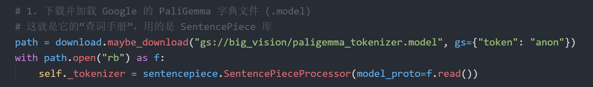
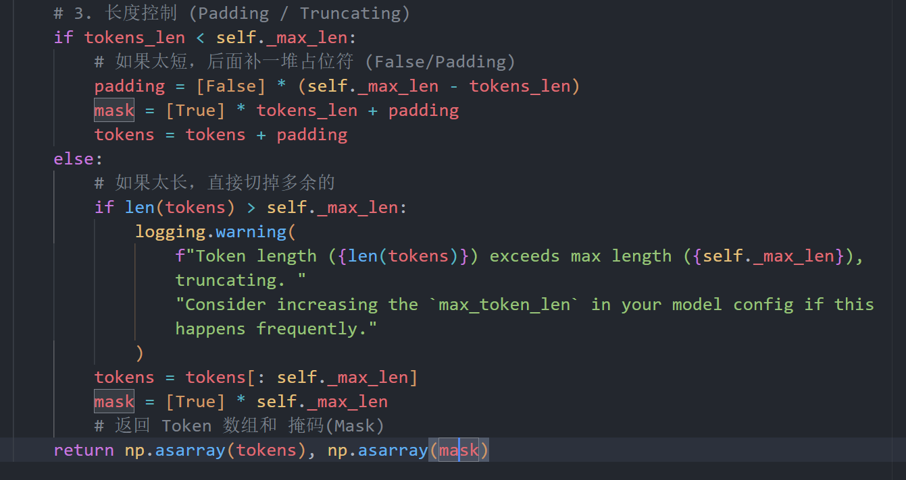
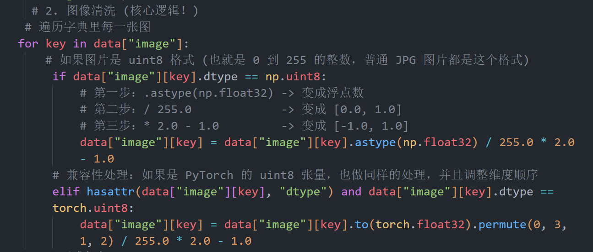
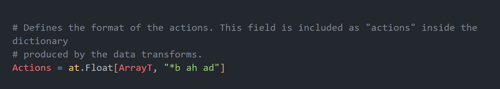
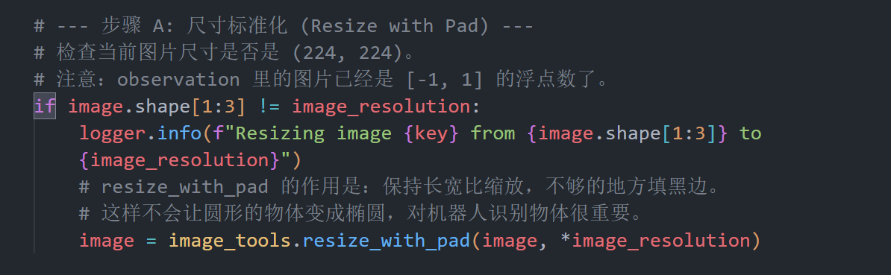
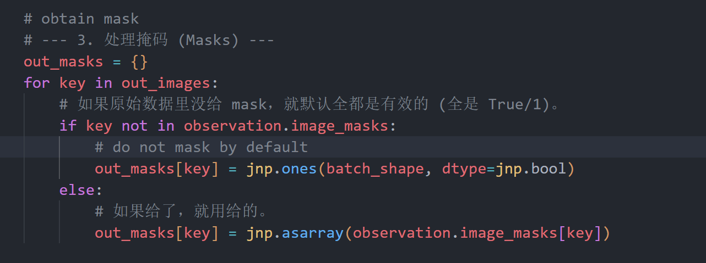
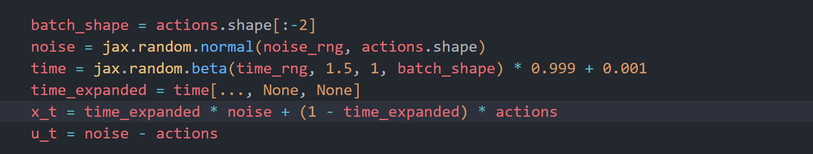
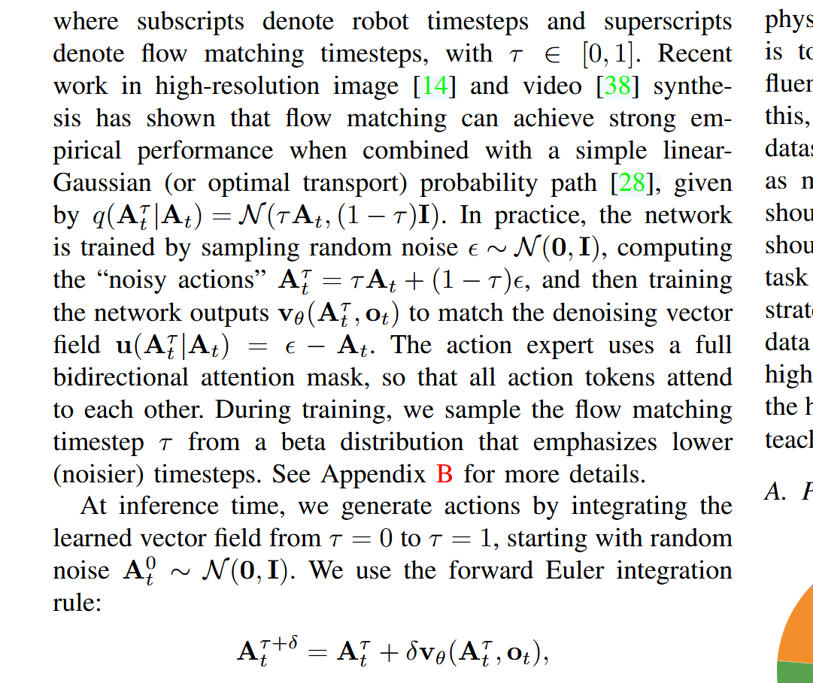
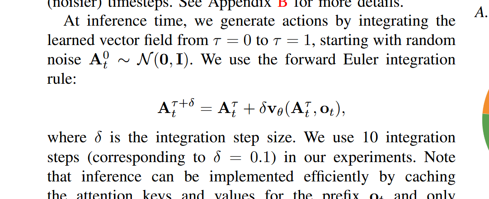

# Tokenizer.py 文件
这个文件是 Pi0 系统的**多模态输入“翻译官”**，其核心功能是将**人类的自然语言指令**（Prompt）统一转换为模型可以处理的**Token ID 序列**（整数数组）。
这个文件里有 4 个类，但只需要关注第一个，后两个不是给pi 0模型用的，第二个是pi 0fast 的模型

**PaliGemma** 是由 Google 开发的视觉-语言模型。在这里我们并没有完全调用这个模型，而是调用了其中的.model文件，这个文件类似于查词字典。**它的作用：** 规定了哪个单词对应哪个数字。
> - 比如：PaliGemma 规定 "apple" = `1092`，"pick" = `554`。
> - 这本字典必须固定，不能乱改。

   ### 2. 为什么要用它的字典？（兼容性原理）
- **原因**：Pi0 模型的大脑里，负责“理解语言”的那一部分神经元，很有可能是**直接从 PaliGemma 模型里“移植”过来的**，或者是照着它的结构
- **后果**：如果不使用同一本字典，Pi0 就会听不懂人话。
    - 如果你用另一本字典把 "apple" 变成了 `888`。
    - 传给 Pi0 后，Pi0 可能会以为 `888` 代表“汽车”。
    - 那就全乱套了！
所以，**这段代码的作用就是“统一语言标准”**。


这里的mask就是attention的注意力掩码机制，是为了模型只去关注有用的信息
举例：
- **设定**：假设 `max_len = 10`（最长只能读 10 个词）。
- **情况 A**：你的指令是 "Pick up apple"（3 个词）。
- **情况 B**：你的指令是 "Move the blue block to the left"（7 个词）。

为了让这两句话能塞进同一个模型里批量处理，必须把它们都凑成 10 个词的长度
- **凑单（Padding）**：对于情况 A，我们在后面补上 7 个毫无意义的“占位符”（通常是 0）。
    - 变成：`[Pick, up, apple, <空>, <空>, <空>, <空>, <空>, <空>, <空>]
 
 Mask 是“重点划线笔”

这时候问题来了：模型在计算 **Attention（注意力）** 的时候，如果不告诉它，它会傻乎乎地去研究后面那 7 个 `<空>` 是什么意思。

**Mask 的作用就是告诉模型：“只看前面，别看后面！”**

# ==model.py 文件==
## 1.class Observation(Generic[ArrayT]): 
它的作用是把各种乱七八糟的原始数据（摄像头的图、机器人的关节角度、人类的指令）统一打包成一个格式严谨的对象，方便后续模型处理。
在这个函数里面，观察值包括图像、语言指令、关节角度、**没有noise action**，这个是放在pi 0.py文件处理的。



疑问：图片具体是怎么处理的，这里的for循环又是循环谁？
**这个 `for` 循环是在循环“摄像头”，而不是“像素”！**

它**绝对没有**一个个去循环那几百万个像素点（那样 Python 会跑得比蜗牛还慢）。

为了让你彻底明白，我把这个过程拆解成 **“宏观循环”** 和 **“微观魔法”** 两部分：
### 1. `for` 循环是在数“摄像头” (The Loop)

看代码：

Python
```
for key in data["image"]:
```
这里的 `data["image"]` 是一个**字典 (Dictionary)**，它的结构大概长这样：

Python
```
data["image"] = {
    "base_0_rgb":        [一个巨大的图片矩阵],  # 机器人身体的主摄像头
    "left_wrist_0_rgb":  [一个巨大的图片矩阵],  # 左手手腕摄像头
    "right_wrist_0_rgb": [一个巨大的图片矩阵]   # 右手手腕摄像头
}
```
所以，这个 `for` 循环**只执行了 3 次**（如果有 3 个摄像头的话）：

- **第 1 次**：`key` 是 `"base_0_rgb"`。
    
- **第 2 次**：`key` 是 `"left_wrist_0_rgb"`。
    
- **第 3 次**：`key` 是 `"right_wrist_0_rgb"`。

它是在遍历**不同的视角**，而不是图片里的内容。
### 2. 那几百万个像素是怎么清洗的？ (Vectorization)

你可能会问：“那每个图片里有 `224 * 224 * 3 = 150,528` 个像素点，它是怎么处理的？”

答案在这一行代码里：

Python
```
data["image"][key] = data["image"][key].astype(np.float32) / 255.0 * 2.0 - 1.0
```
这用到了 NumPy/JAX/PyTorch 最强大的功能：**向量化运算 (Vectorization)** / **广播 (Broadcasting)**。

**对于标准的 Pi0 模型来说，`tokenizer.py` 只负责处理“语言指令”。**
图像（Images）和关节状态（Robot State）的处理逻辑不在 tokenizer 里，而是在model.py文件以及还没上传的 `pi0.py` 里。
在model.py里面，图像并没有变成 Token ID（整数），而是变成了**标准化的数学矩阵（浮点数）**。
- **处理地点**：`model.py` 的 `Observation` 类和 `preprocess_observation` 函数。
    
- **处理步骤**：
    
    1. **尺寸整形**：不管你原来的图多大，`preprocess_observation` 都会把它缩放（Resize）或者填充（Pad）成 **224x224**。
        
    2. **数值归一化**：在 `Observation.from_dict` 里，把 `0-255` 的像素整数除以 255，再通过公式 `x / 255.0 * 2.0 - 1.0` 变成 **-1.0 到 1.0 之间的小数**。
        
- **最终形态**：一个形状为 `(Batch, 224, 224, 3)` 的浮点数矩阵 (`float32`)。它还是像素，不是 Token。


### `at.Float`：是小数，不是整数  ⭐⭐⭐

这意味着机器人的动作是**连续的数值**（比如 `0.5` 弧度，`-1.2` 米/秒），而不是像语言模型那样输出一个个离散的单词 ID（Token）。

### 2. `"*b ah ad"`：这串神秘字母是形状密码

这是最核心的部分，它规定了输出矩阵的维度：

- **`*b` (Batch Size)**：**批量大小**。
    
    - 意思是一次同时处理多少个任务。
        
- **`ah` (Action Horizon)**：**动作视野 / 预测未来几步**。
    
    - **关键概念**：现在的机器人模型（尤其是 Pi0 这种）通常不会只预测“下一步怎么动”，而是预测 **“未来的一连串动作”**（比如未来 0.5 秒内的 50 个动作）。
        
    - 这样做动作会更连贯平滑，这在学术上叫 **Action Chunking（动作分块）**。
        
    - 这里的 `ah` 就是指这一串动作的长度（例如 50）。
        
- **`ad` (Action Dimension)**：**动作维度 / 关节数量**。
    
    - 机器人有多少个电机需要控制？
        
    - 比如：如果你有两个手臂（每个 7 自由度）+ 一个底盘（2 自由度），那 `ad` 可能就是 `7 + 7 + 2 = 16`。
### 3. 物理含义翻译

把这些拼起来，`Actions` 就是一个形状为 `[Batch, Horizon, Dimension]` 的大表格。

**举个生动的例子：** 假设 `ah=10` (预测未来10步)，`ad=14` (机器人有14个关节)。 当模型输出一个 `Actions` 对象时，它实际上是在说：

> “为了完成任务，我计划在接下来的 **10个时间点** 里，让我的 **14个关节** 分别转动到这些角度。”


## def preprocess_observation 函数
`preprocess_observation` 是 Pi0 模型中连接“原始数据”和“神经网络”的**关键预处理车间**。它的核心任务是确保不论输入图片尺寸如何，进模型前都得整整齐齐，并且在训练时负责给图片“加特效”（数据增强）。


疑问：图片 [-1, 1] 的浮点数是什么意思？

在你电脑的硬盘里，或者屏幕上显示的普通图片，每个像素点都是一个 **整数 (Integer)**。
- **0** 代表 **纯黑**。
- **255** 代表 **纯白**。
- **128** 代表 **灰色**
这时候，数据的范围是 **`[0, 255]`**。

 #### **它现在变成了什么？（今生：-1 到 1）**

刚才在 `Observation.from_dict` 那个函数里，我们通过公式 `x / 255.0 * 2.0 - 1.0` 做了数学变换。 现在，像素点不再是整数，而是变成了 **小数 (Float)**：
- **-1.0** 代表 **纯黑** (原来的 0)。
    
- **1.0** 代表 **纯白** (原来的 255)。
    
- **0.0** 代表 **灰色** (原来的 128)。
这时候，数据的范围就是你看到的 **`[-1, 1]`**。




## class BaseModelConfig(abc.ABC): 

### 1. 为什么会有这个类？（Manager 的角色）

想象一下，如果 OpenPi 只有一种机器人，那我们直接写死代码就行了。但问题是：
- 有的机器人是双臂（14个关节），有的是单臂（7个关节）。
    
- 有的任务要预测未来 50 步，有的只预测 10 步。

所以我们需要一个 **Config（配置单）**。 `BaseModelConfig` 就是一张**空白的通用表格**，所有想造机器人的人，都必须按这个格式填表。

## 总结 ⭐⭐⭐⭐
这份 `model.py` 文件是整个 OpenPi 项目的 **“协议层”** 或 **“基础设施层”**。

它不包含具体的神经网络结构（那个在 `pi0.py` 里），但它规定了所有模型 **“吃什么（输入）”**、**“吐什么（输出）”** 以及 **“怎么启动（加载）”**。

我将其分为三大板块来总结：

---

### 第一板块：数据容器与预处理 (Data Handling)

这一部分负责把乱七八糟的原始数据，变成模型能消化的标准格式。

#### 1. `class Observation` (数据快递箱)

- **作用**：标准化的输入数据容器。不管你是用 PyTorch 还是 JAX，不管你有几个摄像头，进模型前都得装进这个箱子。
    
- **核心内容**：
    
    - `images`：视觉数据（必须是 `[-1, 1]` 的浮点数）。
        
    - `state`：机器人的关节角度。
        
    - `tokenized_prompt`：把人类语言转换成的数字 ID。
        
- **关键方法**：
    
    - **`from_dict`**：**全自动清洗机**。
        
        - 它能识别输入是 Numpy 还是 PyTorch Tensor。
            
        - 它负责把 `0~255` 的整数图片强行压缩成 `[-1, 1]` 的小数。
            

#### 2. `def preprocess_observation` (预处理车间)

- **作用**：在数据进入模型前的最后一步加工。
    
- **核心逻辑**：
    
    - **尺寸统一**：把所有图片 `resize_with_pad` 到 `224x224`。
        
    - **训练增强 (Train=True)**：给图片加噪点、旋转、裁剪（为了防止过拟合）。
        
    - **推理模式 (Train=False)**：只做缩放，保持原汁原味。
        
    - **生成 Mask**：给缺失的摄像头补上“请假条”（Mask=False）。
        

#### 3. `Actions` (输出标准)

- **作用**：定义了模型输出的形状 `[Batch, Horizon, Dim]`（比如：一次预测未来 50 步的 14 个关节动作）。
    

### 第二板块：模型管理与配置 (Model Management)

这一部分是“工厂图纸”，规定了如何制造和唤醒一个模型。

#### 1. `class BaseModelConfig` (总工程师蓝图)

- **作用**：所有具体模型（如 Pi0, Pi0-Fast）配置文件的父类。
    
- **核心属性**：规定了机器人必须有的参数（关节数 `action_dim`、预测步数 `action_horizon`）。
    
- **关键方法**：
    
    - **`create` (抽象)**：强制子类必须实现“如何搭建神经网络”。
        
    - **`load` (JAX 版)**：**“借尸还魂术”**。利用 `eval_shape` 创建不占显存的空壳模型，然后精准注入权重。
        
    - **`load_pytorch` (兼容版)**：**“外交官”**。专门用来加载 PyTorch 格式的 `.safetensors` 权重，方便非 JAX 用户使用。
        
    - **`fake_obs` / `fake_act`**：制造全 1 的假数据，方便调试代码跑通流程。
        

#### 2. `class BaseModel` (模型基类)

- **作用**：定义了模型必须具备的两个能力接口。
    
    - **`compute_loss`**：**训练用**。给数据和答案，算出考了多少分（Loss）。
        
    - **`sample_actions`**：**推理用**。给观察数据，算出下一步怎么动。
        

### 第三板块：底层工具 (Utilities)

#### 1. `def restore_params` (读档工具)

- **作用**：高性能文件读取器。
    
- **核心逻辑**：
    
    - 使用 Google 的 `Orbax` 库。
        
    - 支持 **多卡分片 (Sharding)**：如果要在 TPU 集群上跑，它能自动把巨大的模型切片加载到不同显卡上。
        
    - **去包装**：负责把 `nnx` 库自动添加的 `.value` 后缀清理干净，返回纯净的参数字典。
        
### 一句话总结

**`model.py` 不造大脑（不含神经网络层），但它造了大脑的血管（数据管道 Observation）、骨架（配置 Config）和苏醒仪式（加载函数 load/restore）。**

# Pi 0.py

## 🏗️ 文件结构

```
pi0.py
├── 工具函数 (19-77 行)
│   ├── make_attn_mask()      # 混合注意力掩码
│   └── posemb_sincos()       # 正弦余弦位置编码
│
└── Pi0 类 (80-294 行)
    ├── __init__()            # 模型初始化
    ├── embed_prefix()        # 编码图像+语言
    ├── embed_suffix()        # 编码状态+动作+时间
    ├── compute_loss()        # 训练损失（Flow Matching）
    └── sample_actions()      # 推理采样
```
## def make_attn_mask(input_mask, mask_ar):
### 输入：
这个函数接收两个关键的布尔型（True/False）数组，它们描述了序列中每个位置的属性：

| **输入变量**         | **数据类型与形状**      | **物理意义**                                                                      |     |
| ---------------- | ---------------- | ----------------------------------------------------------------------------- | --- |
| **`input_mask`** | `bool[Batch, N]` | **有效性标记**：标记哪些位置是真实数据（`True`），哪些是为了对齐长度补的 0（`False`，即 Padding）。               |     |
| **`mask_ar`**    | `bool[Batch, N]` | **因果标记**：`False` 代表“组内成员”（如图像像素），可以互相看；`True` 代表“因果转折点”，开启新的时间步（如动作序列），不能看未来。 | 3   |
### 输出：
返回一个形状为 **`[Batch, N, N]`** 的布尔矩阵。
**含义**：
- 这是一个“可见性地图”。
- **`True` (1)**：允许注意力计算（Query 可以提取该 Key 的信息）。
- **`False` (0)**：屏蔽该位置（Query 对该 Key 视而不见）。
### **第 1 步：广播维度 (第 38 行)**

```python
mask_ar = jnp.broadcast_to(mask_ar, input_mask.shape)
```

**作用**: 确保 `mask_ar` 和 `input_mask` 形状一致

**示例**:

```python
# 输入
input_mask.shape = (2, 6)  # [batch=2, seq_len=6]
mask_ar.shape = (6,)       # [seq_len=6]

# 广播后
mask_ar.shape = (2, 6)     # 复制到每个 batch
```

### **第 2 步：生成组 ID (第 43 行) - 核心魔法！**

```python
cumsum = jnp.cumsum(mask_ar, axis=1)
```

**这是整个函数的核心！** 通过累加求和，将 `mask_ar` 转换为"组 ID"。

#### **详细示例**:

```python
# 示例 1: 简单情况
mask_ar = [False, False, True, False, True]
cumsum  = [0,     0,     1,    1,     2]
         └─ 组0 ─┘ └─ 组1 ─┘ └组2┘

# 示例 2: 实际场景
tokens  = [Img1, Img2, Lang, State, Act1, Act2]
mask_ar = [False, False, False, True,  True, False]
cumsum  = [0,     0,     0,     1,     2,    2]
          图片和文字一组 state一组 Act一组
```

**理解关键**:
- `False` (0): "我和前一个 token 是同一组"
- `True` (1): "我开启新的组"
- `cumsum` 累加后，相同数字 = 同一组
### **第 3 步：构建注意力矩阵 (第 50 行) - 最难理解的部分！**

```python
attn_mask = cumsum[:, None, :] <= cumsum[:, :, None]
```

#### **维度变换解析**:

```python
cumsum.shape = (batch, seq_len)

# 广播机制
cumsum[:, None, :].shape = (batch, 1, seq_len)      # Key 的组 ID
cumsum[:, :, None].shape = (batch, seq_len, 1)      # Query 的组 ID

# 比较后
attn_mask.shape = (batch, seq_len, seq_len)
```
✨🌟知识补充 
**Query (Q) —— 你手中的“查询请求”**
    - **含义**：这是你的需求。是你拿着的一张小纸条，上面写着：“我想找关于微观粒子物理规律的书”。
    - **在 Transformer 里**：Query 是**当前这个词（比如“我”）**，它拿着自己的特征向量去问全场：“谁跟我的关系最紧密？谁能帮我补全语义？”
        
- **Key (K) —— 书脊上的“标签/索引”**
    - **含义**：这是匹配的依据。每本书的书脊上都有个标签，比如《量子物理史话》的标签是“物理、微观、粒子”；《哈利波特》的标签是“魔幻、小说、英国”。
        
    - **在 Transformer 里**：Key 是**句子里的每一个词（包括“我”自己）**用来**展示自己特征**的向量。它像一个招牌，等着 Query 来对号入座。
        
- **Value (V) —— 书里的“正文内容”**
    - **含义**：这是真正的价值。当你发现你的查询（Q）和某本书的标签（K）对上号了，你真正要拿走的是这本书里的**内容**（知识）。
        
    - **在 Transformer 里**：Value 是**每个词包含的实际信息**。如果 Query 觉得这个词很重要（Q和K匹配度高），就会把这个词的 Value 拿走，融入到自己的理解中。
#### **比较逻辑**:

```python
attn_mask[b, i, j] = (cumsum[b, j] <= cumsum[b, i])
                      ↑              ↑
                   Key 的组 ID   Query 的组 ID
```

**含义**:

- **Query (i)** 可以看到 **Key (j)**，当且仅当 `Key 的组 ID ≤ Query 的组 ID`
- 这实现了：**组内互看 + 组间只能往回看（因果）**
### **第 4 步：处理填充 (第 55 行)**

```python
valid_mask = input_mask[:, None, :] * input_mask[:, :, None]
```

**作用**: 确保填充位置不参与注意力

```python
# 外积计算
input_mask = [True, True, False]  # 第 3 个是填充

valid_mask = 
    [[True,  True,  False],   # Query 0 只能看到有效的 Key
     [True,  True,  False],   # Query 1 只能看到有效的 Key
     [False, False, False]]   # Query 2 是填充，不能看任何东西
```

### **第 5 步：合并规则 (第 58 行)**

```python
return jnp.logical_and(attn_mask, valid_mask)
```

**最终掩码** = (符合因果逻辑) **AND** (不是填充)

### 📊 完整可视化示例

#### **场景**: π₀ 模型的一次推理

```python
# 输入序列
tokens = [
    Img1, Img2, Img3,  # 图像 tokens
    Lang1, Lang2,      # 语言 tokens
    State,             # 状态 token
    Act1, Act2, Act3   # 动作 tokens
]

# mask_ar 定义
mask_ar = [
    False, False, False,  # 图像内部全连接
    False, False,         # 语言内部全连接
    True,                 # 状态开启新组
    True, False, False    # 动作第一个开启新组，后续全连接
]

# 生成组 ID
cumsum = [
    0, 0, 0,  # 组 0: 图像+语言
    0, 0,     # 组 0: 图像+语言
    1,        # 组 1: 状态
    2, 2, 2   # 组 2: 动作
]
```

### **注意力矩阵可视化**:

```
attn_mask[i, j] = (cumsum[j] <= cumsum[i])

       j→  Img1 Img2 Img3 Lang1 Lang2 State Act1 Act2 Act3
       组ID:  0    0    0    0     0     1    2    2    2
i↓
Img1  (0)   ✓    ✓    ✓    ✓     ✓     ✗    ✗    ✗    ✗
Img2  (0)   ✓    ✓    ✓    ✓     ✓     ✗    ✗    ✗    ✗
Img3  (0)   ✓    ✓    ✓    ✓     ✓     ✗    ✗    ✗    ✗
Lang1 (0)   ✓    ✓    ✓    ✓     ✓     ✗    ✗    ✗    ✗
Lang2 (0)   ✓    ✓    ✓    ✓     ✓     ✗    ✗    ✗    ✗
State (1)   ✓    ✓    ✓    ✓     ✓     ✓    ✗    ✗    ✗
Act1  (2)   ✓    ✓    ✓    ✓     ✓     ✓    ✓    ✗    ✗
Act2  (2)   ✓    ✓    ✓    ✓     ✓     ✓    ✓    ✓    ✗
Act3  (2)   ✓    ✓    ✓    ✓     ✓     ✓    ✓    ✓    ✓
```

**解读**:
- **Img/Lang (组 0)**: 互相可见（全连接）
- **State (组 1)**: 可以看到组 0，但组 0 看不到它（因果）
- **Act (组 2)**: 可以看到组 0 和组 1，但组 0/1 看不到它（因果）
- **Act 内部**: 因果注意力（Act3 可以看到 Act1/Act2，但 Act1 看不到 Act2/Act3）

## def posemb_sincos（）
在 `pi0.py` 的代码中，`posemb_sincos` 主要被用来给 **扩散模型的“时间步 (Timestep)”** 编码，而不是给文字的位置编码。
### 📋 函数概览

```python
@at.typecheck
def posemb_sincos(
    pos: at.Real[at.Array, " b"],           # 输入：位置/时间步 [batch]
    embedding_dim: int,                      # 输出维度（必须是偶数）
    min_period: float,                       # 最小周期（高频）
    max_period: float = 4.0                  # 最大周期（低频）
) -> at.Float[at.Array, "b {embedding_dim}"]:  # 输出：[batch, embedding_dim]
    """
    为标量位置计算正弦-余弦位置编码
    
    用途：将时间步 t ∈ [0, 1] 编码为高维向量
    原理：使用不同频率的正弦和余弦波组合
    """
```
## 🔍 逐行代码分析

## **第 1 步：参数验证 (70-71 行)**

```python
if embedding_dim % 2 != 0:
    raise ValueError(f"embedding_dim ({embedding_dim}) must be divisible by 2")
```

**为什么必须是偶数？**

- 因为输出是 `[sin(...), cos(...)]` 拼接
- 前一半是 sin，后一半是 cos
- 如果是奇数，无法平均分配

**示例**:

```python
embedding_dim = 512  # ✓ 正确
embedding_dim = 513  # ✗ 报错
```
## **第 2 步：生成频率分布 

```python
fraction = jnp.linspace(0.0, 1.0, embedding_dim // 2)
```

**作用**: 生成从 0 到 1 的等差数列

**示例**:

```python
embedding_dim = 8
fraction = jnp.linspace(0.0, 1.0, 4)
# fraction = [0.0, 0.333, 0.667, 1.0]
```

**含义**:

- `fraction[0] = 0.0` → 最低频率（最长周期）
- `fraction[-1] = 1.0` → 最高频率（最短周期）
## **第 3 步：计算周期 (74 行) - 核心公式！**

```python
period = min_period * (max_period / min_period) ** fraction
```

#### **数学推导**:

```python
period = min_period * (max_period / min_period) ^ fraction

# 当 fraction = 0:
period[0] = min_period * (max_period / min_period) ^ 0
          = min_period * 1
          = min_period  # 最短周期（最高频）

# 当 fraction = 1:
period[-1] = min_period * (max_period / min_period) ^ 1
           = min_period * (max_period / min_period)
           = max_period  # 最长周期（最低频）
```

#### **实际计算示例**:

```python
min_period = 0.004  # 4e-3
max_period = 4.0
embedding_dim = 8

fraction = [0.0, 0.333, 0.667, 1.0]

period[0] = 0.004 * (4.0 / 0.004) ^ 0.0   = 0.004
period[1] = 0.004 * (4.0 / 0.004) ^ 0.333 = 0.04
period[2] = 0.004 * (4.0 / 0.004) ^ 0.667 = 0.4
period[3] = 0.004 * (4.0 / 0.004) ^ 1.0   = 4.0
```

**对数尺度分布**:

```
period = [0.004, 0.04, 0.4, 4.0]
         ↑ 高频  ↑ 中频 ↑ 低频 ↑ 最低频
```

**为什么用指数分布？**

- 覆盖多个数量级（0.004 → 4.0，跨越 1000 倍）
- 低频和高频都有足够的表示能力
- 类似于傅里叶变换的频率分布

## **第 4 步：计算正弦输入  - 最复杂的一行！**

```python
sinusoid_input = jnp.einsum(
    "i,j->ij",
    pos,                              # [batch]
    1.0 / period * 2 * jnp.pi,       # [embedding_dim // 2]
    precision=jax.lax.Precision.HIGHEST
)
```
这行代码是整个位置编码（Positional Embedding）中最核心的数学运算步骤。
它做的事情叫做 **“外积” (Outer Product)**。简单来说，就是把一列**时间**和一排**频率**进行两两相乘，生成一个巨大的**相位矩阵**。
可以拆解成三个步骤：
### 第一步：拆解两个输入 (Inputs)

1. **输入 A (`pos`) —— 它是“时间 $t$”**
    
    - **代码里**：`pos`，维度标记为 `"i"`（Batch Size）。
        
    - **形状**：是一个长度为 $B$ 的向量 `[t1, t2, ..., tB]`。
        
    - **含义**：比如你有 3 张图要处理，它们的去噪进度分别是 `[0.1, 0.5, 0.9]`。
        
2. **输入 B (`1.0 / period * 2 * jnp.pi`) —— 它是“角频率 $\omega$”**
    
    - **代码里**：那一长串算式，维度标记为 `"j"`（特征维度 Dim/2）。
        
    - **形状**：是一个长度为 $D/2$ 的向量 `[w1, w2, ..., wD]`。
        
    - **数学推导**：
        
        - `period` ($T$) 是周期。
            
        - `1.0 / period` ($f$) 是频率。
            
        - `* 2 * jnp.pi` ($\omega = 2\pi f$) 是**角频率**。
            
    - **含义**：这是我们在上一行代码里造出来的几百个不同快慢的“时钟指针转速”。
        
### 第二步：理解 `einsum("i,j->ij", ...)`

`einsum` 是爱因斯坦求和约定 (Einstein Summation) 的缩写。这里的 `"i,j->ij"` 翻译成人话就是：

> “拿第一个向量的第 $i$ 个元素，乘以第二个向量的第 $j$ 个元素，放到结果矩阵的 $(i, j)$ 位置上去。”

这就像是我们在小学背的 **“九九乘法表”**：

- 竖着的是 $1 \sim 9$ (时间 $t$)。
    
- 横着的是 $1 \sim 9$ (频率 $\omega$)。
    
- 中间的格子就是它们的乘积。
    

**图解矩阵运算：**

$$\begin{bmatrix} t_1 \\ t_2 \\ \vdots \\ t_B \end{bmatrix} \times \begin{bmatrix} \omega_1 & \omega_2 & \dots & \omega_D \end{bmatrix} = \begin{bmatrix} t_1\cdot\omega_1 & t_1\cdot\omega_2 & \dots & t_1\cdot\omega_D \\ t_2\cdot\omega_1 & t_2\cdot\omega_2 & \dots & t_2\cdot\omega_D \\ \vdots & \vdots & \ddots & \vdots \\ t_B\cdot\omega_1 & t_B\cdot\omega_2 & \dots & t_B\cdot\omega_D \end{bmatrix}$$

### 第三步：为什么要做这一步？ (Reasoning)

我们最终的目标是计算正弦波 $\sin(\omega \cdot t)$ 和余弦波 $\cos(\omega \cdot t)$。

- 正弦函数的输入必须是 **角度 (Phase)**。
    
- 角度 = **角频率 ($\omega$) $\times$ 时间 ($t$)**。
    

通过这个 `einsum`：

1. 我们一次性算出了**每一张图片**（Batch $i$）在**每一个频率**（Dim $j$）下的角度值。
    
2. 生成的 `sinusoid_input` 是一个二维矩阵 `(Batch, Dim/2)`。
    
3. 下一行代码直接对这个矩阵做 `jnp.sin()` 和 `jnp.cos()`，就得到了最终的位置编码向量。

### **第 5 步：计算正弦和余弦 (76 行)**

```python
return jnp.concatenate([jnp.sin(sinusoid_input), jnp.cos(sinusoid_input)], axis=-1)
```

#### **操作分解**:

```python
sin_part = jnp.sin(sinusoid_input)  # [batch, embedding_dim // 2]
cos_part = jnp.cos(sinusoid_input)  # [batch, embedding_dim // 2]

output = jnp.concatenate([sin_part, cos_part], axis=-1)
# output.shape = [batch, embedding_dim]
```

#### **完整示例**:

```python
# 输入
sinusoid_input = [
    [0.0,     0.0,     0.0,     0.0],      # t=0.0
    [785.4,   78.54,   7.854,   0.7854],  # t=0.5
    [1570.8,  157.08,  15.708,  1.5708],  # t=1.0
]

# 计算 sin
sin_part = [
    [0.0,     0.0,     0.0,     0.0],
    [0.707,   0.707,   0.707,   0.707],
    [1.0,     1.0,     1.0,     1.0],
]

# 计算 cos
cos_part = [
    [1.0,     1.0,     1.0,     1.0],
    [0.707,   0.707,   0.707,   0.707],
    [0.0,     0.0,     0.0,     0.0],
]

# 拼接
output = [
    [0.0, 0.0, 0.0, 0.0, 1.0, 1.0, 1.0, 1.0],  # t=0.0
    [0.707, 0.707, 0.707, 0.707, 0.707, 0.707, 0.707, 0.707],  # t=0.5
    [1.0, 1.0, 1.0, 1.0, 0.0, 0.0, 0.0, 0.0],  # t=1.0
]
# output.shape = [3, 8]
```

| **编码类型**   | **负责什么？**                            | **代码变量名**   | **用的函数**                   |
| ---------- | ------------------------------------ | ----------- | -------------------------- |
| **序列位置编码** | **空间/逻辑顺序**：区分单词的前后、图片Patch的上下左右。    | `positions` | `jnp.cumsum` (传给 LLM 内部处理) |
| **时间位置编码** | **时间/去噪进度**：区分动作生成的阶段（草稿阶段 vs 精修阶段）。 | `time_emb`  | `posemb_sincos`            |
## class Pi0(model.BaseModel):
### 📋 类概览

```python
class Pi0(_model.BaseModel):
    """
    π₀ 和 π₀.₅ 视觉-语言-动作（VLA）模型
    
    继承自: BaseModel
    框架: JAX + Flax NNX
    训练方法: Flow Matching
    推理方法: 迭代去噪（Euler 积分）
    """
```
### 🔍 方法总览

| 方法                 | 行号      | 功能         | 调用时机    |
| ------------------ | ------- | ---------- | ------- |
| `__init__()`       | 80-117  | 初始化模型组件    | 模型创建时   |
| `embed_prefix()`   | 120-151 | 编码图像+语言    | 推理/训练   |
| `embed_suffix()`   | 154-200 | 编码状态+动作+时间 | 推理/训练   |
| `compute_loss()`   | 203-228 | 计算训练损失     | **训练时** |
| `sample_actions()` | 231-293 | 采样动作       | **推理时** |
## ## 1️⃣ `__init__()` - 模型初始化
### **完整代码分析**:

```python
def __init__(self, config: pi0_config.Pi0Config, rngs: nnx.Rngs):
    # 1. 调用父类初始化
    super().__init__(config.action_dim, config.action_horizon, config.max_token_len)
    
    # 2. 保存配置
    self.pi05 = config.pi05  # 是否是 π₀.₅ 版本
    
    # 3. 获取模型配置
    paligemma_config = _gemma.get_config(config.paligemma_variant)      # PaliGemma 2B
    action_expert_config = _gemma.get_config(config.action_expert_variant)  # Gemma 300M
```

### **3.1 初始化语言编码器 (87-94 行)**

```python
    # 4. 初始化双 Gemma 架构
    llm = nnx_bridge.ToNNX(
        _gemma.Module(
            configs=[paligemma_config, action_expert_config],  # 两个模型
            embed_dtype=config.dtype,  # bfloat16 或 float32
            adarms=config.pi05,  # π₀.₅ 使用 AdaRMSNorm
        )
    )
    llm.lazy_init(
        rngs=rngs, 
        method="init", 
        use_adarms=[False, True] if config.pi05 else [False, False]
        #          ↑ PaliGemma  ↑ Action Expert
    )
```

**关键点**:

- **双模型架构**: Pi0 整体用的是PaliGemma 2B (多模态编码) + Gemma 300M (动作专家)
**PaliGemma：负责图像与文本理解  Gemma (Action Expert)：负责动作生成**
- AdaRMSNorm: π₀.₅ 在 Action Expert 中使用，π₀ 不使用
- **lazy_init**: 延迟初始化，节省内存

### **3.2 初始化视觉编码器 **

```python
    # 5. 初始化 SigLIP 视觉编码器
    img = nnx_bridge.ToNNX(
        _siglip.Module(
            num_classes=paligemma_config.width,  # 输出维度 = 2048
            variant="So400m/14",  # SigLIP-So400m, patch_size=14
            pool_type="none",  # 不做池化，保留所有 patch tokens
            scan=True,  # 使用 JAX scan 优化内存
            dtype_mm=config.dtype,  # 矩阵乘法精度
        )
    )
    img.lazy_init(
        next(iter(config.fake_obs().images.values())),  # 用假数据初始化
        train=False, 
        rngs=rngs
    )
```

**SigLIP 配置**:
Siglip就是包含在paligemma里面的
- **So400m/14**: 400M 参数，14×14 patch size
- **输出**: 每张图像 → 256 个 tokens (16×16 patches)

### **3.3 组合 PaliGemma**

```python
    # 6. 组合视觉和语言模型
    self.PaliGemma = nnx.Dict(llm=llm, img=img)
```

**结构**:
```
PaliGemma
├─ img: SigLIP (视觉编码器)
└─ llm: [PaliGemma 2B, Gemma 300M] (语言模
```
### **3.4 动作投影层 (106-114 行)**
```python
 # 7. 动作输入投影
    self.action_in_proj = nnx.Linear(
        config.action_dim,              # 输入: 动作维度 (如 7)
        action_expert_config.width,     # 输出: 隐藏维度 (2560)
        rngs=rngs
    )
    
    # 8. 时间编码 MLP (π₀ vs π₀.₅)
    if config.pi05:
        # π₀.₅: 时间 MLP 用于 AdaRMSNorm
        self.time_mlp_in = nnx.Linear(
            action_expert_config.width,   # 2560 → 2560
            action_expert_config.width, 
            rngs=rngs
        )
        self.time_mlp_out = nnx.Linear(
            action_expert_config.width,   # 2560 → 2560
            action_expert_config.width, 
            rngs=rngs
        )
    else:
        # π₀: 状态投影 + 动作时间融合 MLP
        self.state_proj = nnx.Linear(
            config.action_dim,            # 状态维度 → 隐藏维度
            action_expert_config.width, 
            rngs=rngs
        )
        self.action_time_mlp_in = nnx.Linear(
            2 * action_expert_config.width,  # 动作+时间拼接 → 隐藏维度
            action_expert_config.width, 
            rngs=rngs
        )
        self.action_time_mlp_out = nnx.Linear(
            action_expert_config.width,   # 隐藏维度 → 隐藏维度
            action_expert_config.width, 
            rngs=rngs
        )
    
    # 9. 动作输出投影
    self.action_out_proj = nnx.Linear(
        action_expert_config.width,     # 隐藏维度 → 动作维度
        config.action_dim, 
        rngs=rngs
    )
```

以pi 0为例（代码里面有分成pi 0和pi 0.5）
### 1. 关于“动作投影” (Action/State Projection)

- **你的问题**：“为什么要投影？`state_proj` 和 `action_out_proj` 是干嘛的？”
    
- **核心答案**：**为了解决“维度不匹配”的矛盾**。
    
    - **物理世界（身体）**：数据很小（比如 14 个关节角度）。
        
    - **神经网络（大脑）**：数据很大（比如 2048 维的思考空间）。
        
    - **解决方法**：
        
        - **`state_proj` (入口)**：充当“升维适配器”，把 14 个数字变成 2048 个，让大脑能听懂身体的状态。
            
        - **`action_out_proj` (出口)**：充当“降维适配器”，把大脑想出来的 2048 个数字变回 14 个指令，控制电机转动。
### 2. 关于“中间的 MLP” 和 “图片/文字的处理”

- **你的问题**：“中间的 `mlp_in/out` 是干嘛的？图片和文字为什么不用上面的投影层？”
    
- **核心答案 A (关于 MLP)**：**它们是“时间信号的调酒师”**。
    
    - `posemb_sincos` 生成的时间信号是生的原料。
        
    - **`mlp_in` / `mlp_out`** 负责加工这些时间信号，把它们变成能调节模型去噪力度的“激素”（Conditioning）或者混合到动作 Token 里。
        
- **核心答案 B (关于图片/文字)**：**它们有自己的“VIP 专用通道”**。
    
    - **图片**：走 **SigLIP 视觉编码器** (`self.PaliGemma.img`)，内部自带了 Patch Embedding 投影层。
        
    - **文字**：走 **Gemma 语言模型** (`self.PaliGemma.llm`)，内部自带了 Word Embedding 投影矩阵。
        
    - 所以它们不需要借用给关节角度设计的 `state_proj`。

### 3.关于输入和输出
- **入口 (`self.action_in_proj`)**：
    
    - **输入对象**：**`noisy_actions`**（加了噪声的动作序列，比如 $x_t$）。
        
    - **代码位置**：在 `embed_suffix` 函数里：
        
        
        ```
        action_tokens = self.action_in_proj(noisy_actions)
        ```
        
    - **作用**：把 **14 维**的噪声动作，投影成 **2048 维**，让模型去“清洗”它。
        
- **出口 (`self.action_out_proj`)**：
    
    - **输入对象**：模型的**高维思考结果**（`suffix_out`）。
        
    - **代码位置**：在 `compute_loss` 函数的最后：
        
        ```
        v_t = self.action_out_proj(suffix_out[:, -self.action_horizon :])
        ```
        
    - **作用**：把 **2048 维**的处理结果，投影回 **14 维**，得到去噪后的动作（或者速度 $v_t$）。
        

**总结：** 这两个层构成了扩散模型的核心循环：**进噪声 $\to$ 处理 $\to$ 出净动作**。
### 4. 单向的“第三者”：状态流 (`self.state_proj`)

这个层是**只进不出**的。

- **输入对象**：**`obs.state`**（机器人当前的关节角度，本体感觉）。
    
- **代码位置**：在 `embed_suffix` 的 `if not self.pi05:` 分支里：
    
    Python
    
    ```
    state_token = self.state_proj(obs.state)[:, None, :]
    ```
    
- **为什么没有 `state_out_proj`？**
    
    - 因为模型的任务是**预测未来的动作**，而不是预测“我现在在哪里”。
        
    - 当前的关节角度只是**条件 (Condition)**，告诉模型：“我现在手在这个位置，请基于这个位置规划下一步”。它被送进模型后，就融合在背景信息里了，不需要再还原出来。

### **3.5 训练/推理标志 (117 行)**

```python
    # 10. 训练/推理模式标志
    self.deterministic = True  # 默认推理模
```

## 2️⃣ `embed_prefix()` - 编码图像和语言 (120-151 行)

### **完整代码分析**:

```python
@at.typecheck
def embed_prefix(self, obs: _model.Observation) -> tuple[
    at.Float[at.Array, "b s emb"],  # tokens
    at.Bool[at.Array, "b s"],       # input_mask
    at.Bool[at.Array, " s"]         # ar_mask
]:
    input_mask = []
    ar_mask = []
    tokens = []
    
    # 1. 编码所有图像
    for name in obs.images:
        # 通过 SigLIP 编码图像
        image_tokens, _ = self.PaliGemma.img(obs.images[name], train=False)
        # image_tokens.shape = [batch, 256, 2048]
        
        tokens.append(image_tokens)
        
        # 为每个图像 token 创建 mask
        input_mask.append(
            einops.repeat(
                obs.image_masks[name],  # [batch] → [batch, 256]
                "b -> b s",
                s=image_tokens.shape[1],
            )
        )
        
        # 图像内部全连接（双向注意力）
        ar_mask += [False] * image_tokens.shape[1]
    
    # 2. 编码语言指令
    if obs.tokenized_prompt is not None:
        # 通过 PaliGemma embedding 层编码
        tokenized_inputs = self.PaliGemma.llm(obs.tokenized_prompt, method="embed")
        # tokenized_inputs.shape = [batch, prompt_len, 2048]
        
        tokens.append(tokenized_inputs)
        input_mask.append(obs.tokenized_prompt_mask)
        
        # 语言和图像之间全连接
        ar_mask += [False] * tokenized_inputs.shape[1]
    
    # 3. 拼接所有 tokens
    tokens = jnp.concatenate(tokens, axis=1)
    input_mask = jnp.concatenate(input_mask, axis=1)
    ar_mask = jnp.array(ar_mask)
    
    return tokens, input_mask, ar_mask
```
### 📋 函数概览

```python
@at.typecheck
def embed_prefix(
    self, 
    obs: _model.Observation  # 观察数据（图像 + 语言）
) -> tuple[
    at.Float[at.Array, "b s emb"],  # tokens: [batch, seq_len, embed_dim]
    at.Bool[at.Array, "b s"],       # input_mask: [batch, seq_len]
    at.Bool[at.Array, " s"]         # ar_mask: [seq_len]
]:
    """
    编码 Prefix（前缀）：图像 + 语言指令
    
    作用：将视觉和语言信息转换为统一的 token 表示
    特点：Prefix 在推理时只计算一次，然后缓存 KV
    """
```
## 🔍 逐行代码分析

### **第 1 步：初始化容器 (122-124 行)**

```python
input_mask = []  # 存储每个 token 是否有效（True=有效，False=填充）
ar_mask = []     # 存储自回归掩码（False=双向，True=因果）
tokens = []      # 存储所有 token embeddings
```

**数据结构**:

- `input_mask`: 列表，每个元素是 `[batch, num_tokens]`
- `ar_mask`: 列表，每个元素是标量 `False` 或 `True`
- `tokens`: 列表，每个元素是 `[batch, num_tokens, embed_dim]`

---

### **第 2 步：编码所有图像 (126-138 行)**

#### **2.1 循环处理每个图像 (126-127 行)**

```python
# embed images
for name in obs.images:
    image_tokens, _ = self.PaliGemma.img(obs.images[name], train=False)
```

**详细解析**:

```python
# obs.images 是一个字典
obs.images = {
    "primary": [batch, 224, 224, 3],  # 主相机
    "wrist": [batch, 224, 224, 3],    # 手腕相机
    # ... 可能有更多相机
}

# 对每个图像调用 SigLIP 编码器
for name in ["primary", "wrist"]:
    image = obs.images[name]  # [batch, 224, 224, 3]
    
    # SigLIP 编码
    image_tokens, _ = self.PaliGemma.img(image, train=False)
    # image_tokens.shape = [batch, 256, 2048]
    #                       ↑      ↑    ↑
    #                    batch  patches embed_dim
```

**SigLIP 编码过程**:

```
输入图像: [batch, 224, 224, 3]
    ↓ Patch 分割 (14×14 patch size)
Patches: [batch, 16×16, 14×14×3]
    ↓ Linear Projection
Patch Embeddings: [batch, 256, 2048]
    ↓ Vision Transformer (多层)
Image Tokens: [batch, 256, 2048]
```

**关键参数**:

- **Patch Size**: 14×14 像素
- **Patches 数量**: (224/14) × (224/14) = 16 × 16 = 256
- **Embedding 维度**: 2048 (PaliGemma 的隐藏维度)

#### **2.2 添加图像 tokens (129 行)**

```python
tokens.append(image_tokens)
```

**示例**:

```python
# 第一次循环（primary 相机）
tokens = [
    [batch, 256, 2048]  # primary 图像的 tokens
]

# 第二次循环（wrist 相机）
tokens = [
    [batch, 256, 2048],  # primary 图像的 tokens
    [batch, 256, 2048]   # wrist 图像的 tokens
]
```
#### **2.3 创建 input_mask (130-136 行)**
**作用**: 标记哪些 token 是真实数据，哪些是 padding（填充）
```python
input_mask.append(
    einops.repeat(
        obs.image_masks[name],  # [batch]
        "b -> b s",
        s=image_tokens.shape[1],  # 256
    )
)
```

**详细解析**:

```python
# obs.image_masks 标记哪些图像是有效的
obs.image_masks = {
    "primary": [True, True, False],   # batch=3, 第3个样本没有 primary 图像
    "wrist": [True, True, True]       # batch=3, 所有样本都有 wrist 图像
}

# einops.repeat 操作
obs.image_masks["primary"] = [True, True, False]  # [batch=3]
    ↓ repeat "b -> b s" with s=256
result = [
    [True, True, ..., True],    # 256 个 True
    [True, True, ..., True],    # 256 个 True
    [False, False, ..., False]  # 256 个 False
]  # [batch=3, seq_len=256]
```

**作用**:

- 如果某个样本没有该图像，所有对应的 tokens 都标记为 `False`（填充）
- 在注意力计算时，填充的 tokens 会被忽略

**einops.repeat 详解**:
**核心是那个魔法字符串 `"b -> b s"`：**

- **`b` (左边)**：代表输入只有一个维度（Batch 维度）。
    
- **`->`**：代表“变换为”。
    
- **`b s` (右边)**：代表输出要有两个维度：Batch 维度 `b` 和 新维度 `s`。
    
- **逻辑**：Einops 会自动发现 `s` 是凭空多出来的，于是它就懂了——**“哦，你要我把原来的数据在 `s` 这个方向上复制粘贴 `s` 次！”**
    
###  图解效果

假设 Batch=2，每张图变成 3 个 Token (`s=3`)：

**变化前 (输入)：**

Python

```
[True, False]  # 形状: (2,)
# 含义：第1张图有效，第2张图无效
```

**`einops.repeat` 之后 (输出)：**

Python

```
[
  [True,  True,  True ],  # 第1张图的3个Token全是True
  [False, False, False]   # 第2张图的3个Token全是False
] 
# 形状: (2, 3)
```
#### **2.4 设置 ar_mask (138 行)**
**作用**: 定义 token 之间的注意力方向（双向 vs 因果）
```python
# image tokens attend to each other
ar_mask += [False] * image_tokens.shape[1]
```

**详细解析**:

```python
# 第一次循环（primary 相机，256 个 tokens）
ar_mask = [False, False, False, ..., False]  # 256 个 False

# 第二次循环（wrist 相机，256 个 tokens）
ar_mask = [False, False, ..., False,  # 前 256 个（primary）
           False, False, ..., False]  # 后 256 个（wrist）
# 总共 512 个 False
```
这里`ar_mask` 是列表，每次循环都会增加一列token。
**含义**:
### `False` 代表什么？

- **含义**：**非自回归 (Non-Autoregressive)** 或 **双向注意力 (Bidirectional)**。
- **潜台词**：“我们是一伙的，我们之间没有时间先后，大家可以**互相随便看**。”
### 为什么图片 (Image) 要设为 `False`？(🌟🌟这里的true和false是针对自回归mask，有效性mask的true和mask只是区分token是不是padding)

你现在处理的是 `embed_prefix`，也就是**图片**部分。

- **物理逻辑**：一张图片虽然被切成了 256 个小块（Tokens），但这些小块是**同时存在**的。左上角的像素和右下角的像素属于同一个时刻。
    
- **注意力需求**：为了理解整张图，左上角的 Token 必须能“看见”右下角的 Token，右下角的也必须能“看见”左上角的。
    
- **结果**：所以这里必须填 `False`。这会让 `make_attn_mask` 知道：“这 256 个 Token 是一个整体（同一个时间步），允许它们内部进行**全连接 (Full Attention)**。”
### 如果是动作 (Action) 会怎样？

在 `embed_suffix` 函数里（处理动作序列时），你会看到 `ar_mask` 变成了 `True`。

- **含义**：**自回归 (Autoregressive)** 或 **因果注意力 (Causal)**。
    
- **物理逻辑**：动作是有先后顺序的。第 2 秒的动作不能依赖第 3 秒的动作（因为第 3 秒还没发生，不能穿越时空偷看答案）。
    
- **结果**：填 `True` 会强制模型开启“防作弊模式”，只能看过去，不能看未来。

---

### **第 3 步：编码语言指令 (141-146 行)**

#### **3.1 检查是否有语言输入 (141 行)**

```python
if obs.tokenized_prompt is not None:
```

**灵活性**: 支持纯视觉任务（无语言指令）

#### **3.2 通过 PaliGemma 编码语言 (142 行)**

```python
tokenized_inputs = self.PaliGemma.llm(obs.tokenized_prompt, method="embed")
```

**详细解析**:

```python
# 输入
obs.tokenized_prompt = [batch, prompt_len]  # 已分词的文本
# 例如: "pick up the cup" → [2053, 1234, 5678, 9012]

# PaliGemma.llm 的 embed 方法
tokenized_inputs = self.PaliGemma.llm(
    obs.tokenized_prompt,  # [batch, prompt_len]
    method="embed"         # 只调用 embedding 层，不做前向传播
)
# tokenized_inputs.shape = [batch, prompt_len, 2048]
```

**PaliGemma embedding 过程**:

```
Token IDs: [batch, prompt_len]
    ↓ Embedding Lookup
Token Embeddings: [batch, prompt_len, 2048]
```

**与图像编码的区别**:

- **图像**: 通过 Vision Transformer 编码（复杂）
- **语言**: 只通过 Embedding 层（简单）

#### **3.3 添加语言 tokens (143-144 行)**

```python
tokens.append(tokenized_inputs)
input_mask.append(obs.tokenized_prompt_mask)
```

**示例**:

```python
# 添加语言 tokens
tokens = [
    [batch, 256, 2048],  # primary 图像
    [batch, 256, 2048],  # wrist 图像
    [batch, 32, 2048]    # 语言指令
]

# 添加语言 mask
input_mask = [
    [batch, 256],  # primary mask
    [batch, 256],  # wrist mask
    [batch, 32]    # 语言 mask
]
```

**obs.tokenized_prompt_mask**:

```python
# 标记哪些 token 是有效的（非填充）
obs.tokenized_prompt_mask = [
    [True, True, True, True, False, False, ...],  # 样本1: 4个有效词
    [True, True, True, True, True, True, ...],    # 样本2: 6个有效词
    [True, True, False, False, False, False, ...]  # 样本3: 2个有效词
]  # [batch, prompt_len]
```

**作用**: 处理变长文本（padding 到统一长度）

#### **3.4 设置语言的 ar_mask (146 行)**

```python
# full attention between image and language inputs
ar_mask += [False] * tokenized_inputs.shape[1]
```

**含义**:

- 语言 tokens 之间全连接
- 语言和图像之间全连接
- 没有因果限制

---

### **第 4 步：拼接所有 tokens (147-149 行)**

```python
tokens = jnp.concatenate(tokens, axis=1)
input_mask = jnp.concatenate(input_mask, axis=1)
ar_mask = jnp.array(ar_mask)
```

**详细解析**:

```python
# 拼接前
tokens = [
    [batch, 256, 2048],  # primary
    [batch, 256, 2048],  # wrist
    [batch, 32, 2048]    # language
]

# 拼接后（沿 axis=1，即 sequence 维度）
tokens = [batch, 544, 2048]
#              ↑
#         256 + 256 + 32

# 同样拼接 input_mask
input_mask = [batch, 544]

# ar_mask 转换为数组
ar_mask = [False] * 544  # [544]
```

---

### **第 5 步：返回结果 (150 行)**

```python
return tokens, input_mask, ar_mask
```

**返回值**:

- `tokens`: `[batch, seq_len, 2048]` - 所有 tokens 的 embeddings
- `input_mask`: `[batch, seq_len]` - 哪些 tokens 是有效的
- `ar_mask`: `[seq_len]` - 注意力模式（全部 False = 全连接）

## def embed_suffix（）
### 📋 函数概览

```python
@at.typecheck
def embed_suffix(
    self, 
    obs: _model.Observation,                    # 观察数据（包含状态）
    noisy_actions: _model.Actions,              # 噪声动作 [batch, horizon, action_dim]
    timestep: at.Float[at.Array, " b"]          # 时间步 [batch] ∈ [0, 1]
) -> tuple[
    at.Float[at.Array, "b s emb"],              # tokens: [batch, seq_len, embed_dim]
    at.Bool[at.Array, "b s"],                   # input_mask: [batch, seq_len]
    at.Bool[at.Array, " s"],                    # ar_mask: [seq_len]
    at.Float[at.Array, "b emb"] | None          # adarms_cond: [batch, embed_dim] (仅 π₀.₅)
]:
    """
    编码 Suffix（后缀）：状态 + 动作 + 时间
    
    作用：将机器人状态、噪声动作和时间步编码为 token 表示
    特点：Suffix 在推理时每步都更新（迭代去噪）
    """
```
## 🔍 逐行代码分析

### **第 1 步：初始化容器 (161-163 行)**

```python
input_mask = []  # 存储每个 token 是否有效
ar_mask = []     # 存储自回归掩码
tokens = []      # 存储所有 token embeddings
```

**与 `embed_prefix()` 的区别**:

- **Prefix**: 静态（图像+语言），只计算一次
- **Suffix**: 动态（状态+动作+时间），每步更新
---
### **第 2 步：π₀ 特有 - 添加状态 token (164-170 行)**

```python
if not self.pi05:
    # add a single state token
    state_token = self.state_proj(obs.state)[:, None, :]
    tokens.append(state_token)
    input_mask.append(jnp.ones((obs.state.shape[0], 1), dtype=jnp.bool_))
    # image/language inputs do not attend to state or actions
    ar_mask += [True]
```
#### **详细解析**:

```python
# 输入
obs.state.shape = [batch, state_dim]
# 例如: [2, 7]  # batch=2, 7维状态（7个关节角度）

# 投影到隐藏维度
state_token = self.state_proj(obs.state)  # [batch, 2560]

# 添加 sequence 维度
state_token = state_token[:, None, :]  # [batch, 1, 2560]
#                            ↑
#                      添加维度，变成序列

# 添加到 tokens
tokens = [[batch, 1, 2560]]  # 一个状态 token
```
#### **[:, None, :] 操作详解**:

```python
# 原始形状
state_proj_output.shape = [batch, embed_dim]
# 例如: [2, 2560]

# 添加维度
state_token = state_proj_output[:, None, :]
# [:, None, :] 等价于 [:, np.newaxis, :]
# 在第1维（中间）插入一个新维度

# 结果形状
state_token.shape = [batch, 1, embed_dim]
# 例如: [2, 1, 2560]

# 可视化
原始: [[a₁, a₂, ..., a₂₅₆₀],    # 样本1
      [b₁, b₂, ..., b₂₅₆₀]]    # 样本2

添加维度后: [[[a₁, a₂, ..., a₂₅₆₀]],   # 样本1，1个token
            [[b₁, b₂, ..., b₂₅₆₀]]]   # 样本2，1个token
```

#### **为什么要添加维度？**

```python
# 目标：所有 tokens 的形状必须一致
image_tokens.shape = [batch, 256, 2048]  # 256 个 tokens
lang_tokens.shape = [batch, 32, 2048]    # 32 个 tokens
state_token.shape = [batch, 1, 2560]     # 1 个 token

# 这样才能在 axis=1 上拼接
```

#### **ar_mask 设置**:

```python
ar_mask += [True]  # 状态 token 开启因果
```

**含义**:

- `True` = 开启新的因果组
- Prefix（图像+语言）不能看到 Suffix（状态+动作）
- 这是 Prefix-Suffix 分离的关键
---
### **第 3 步：编码噪声动作 (172 行)**

```python
action_tokens = self.action_in_proj(noisy_actions)
```

#### **详细解析**:

```python
# 输入
noisy_actions.shape = [batch, action_horizon, action_dim]
# 例如: [2, 16, 7]
#       ↑  ↑   ↑
#    batch 16步 7维动作

# 线性投影
action_tokens = self.action_in_proj(noisy_actions)
# action_tokens.shape = [batch, 16, 2560]

# self.action_in_proj 是 Linear(action_dim → hidden_dim)
# 即: Linear(7 → 2560)
```

#### **noisy_actions 是什么？**
在 **Flow Matching** 中：

```python
# 训练时 (compute_loss)
time = random.beta(1.5, 1)  # 随机时间步 ∈ [0, 1]
noise = random.normal(...)  # 纯噪声
noisy_actions = time * noise + (1 - time) * true_actions
# 插值：t=1 时是纯噪声，t=0 时是真实动作

# 推理时 (sample_actions)
# 初始: noisy_actions = pure_noise (t=1)
# 迭代: noisy_actions = noisy_actions + dt * v_t
# 最终: noisy_actions = clean_actions (t=0)
```
---
### **第 4 步：编码时间步 (174 行)**

```python
# embed timestep using sine-cosine positional encoding with sensitivity in the range [0, 1]
time_emb = posemb_sincos(timestep, self.action_in_proj.out_features, min_period=4e-3, max_period=4.0)
```

#### **详细解析**:

```python
# 输入
timestep.shape = [batch]
# 例如: [0.5, 0.8]  # 两个样本的时间步

# 正弦余弦编码
time_emb = posemb_sincos(
    timestep,                           # [batch]
    self.action_in_proj.out_features,   # 2560
    min_period=4e-3,                    # 0.004
    max_period=4.0                      # 4.0
)
# time_emb.shape = [batch, 2560]

# 示例输出
time_emb = [
    [sin(0.5*ω₁), sin(0.5*ω₂), ..., cos(0.5*ω₁), cos(0.5*ω₂), ...],  # t=0.5
    [sin(0.8*ω₁), sin(0.8*ω₂), ..., cos(0.8*ω₁), cos(0.8*ω₂), ...]   # t=0.8
]
```
---
### **第 5 步：融合时间信息**
####  **π₀ 路径 (183-191 行)**

```python
else:
    # mix timestep + action information using an MLP (no adaRMS)
    time_tokens = einops.repeat(time_emb, "b emb -> b s emb", s=self.action_horizon)
    action_time_tokens = jnp.concatenate([action_tokens, time_tokens], axis=-1)
    action_time_tokens = self.action_time_mlp_in(action_time_tokens)
    action_time_tokens = nnx.swish(action_time_tokens)
    action_time_tokens = self.action_time_mlp_out(action_time_tokens)
    action_expert_tokens = action_time_tokens
    adarms_cond = None
```

**详细解析**:

```python
# 1. 复制时间 embedding 到每个动作步
time_emb.shape = [batch, 2560]
time_tokens = einops.repeat(time_emb, "b emb -> b s emb", s=16)
time_tokens.shape = [batch, 16, 2560]

# einops.repeat 可视化
time_emb = [[t₁, t₂, ..., t₂₅₆₀]]  # [batch=1, 2560]
    ↓ repeat to 16 steps
time_tokens = [
    [[t₁, t₂, ..., t₂₅₆₀],   # step 1
     [t₁, t₂, ..., t₂₅₆₀],   # step 2
     ...
     [t₁, t₂, ..., t₂₅₆₀]]   # step 16
]  # [batch=1, 16, 2560]

# 2. 拼接动作和时间
action_tokens.shape = [batch, 16, 2560]
time_tokens.shape = [batch, 16, 2560]
action_time_tokens = concat([action_tokens, time_tokens], axis=-1)
action_time_tokens.shape = [batch, 16, 5120]
#                                          ↑
#                                    2560 + 2560

# 3. 两层 MLP 融合
action_time_tokens = Linear(5120 → 2560)(action_time_tokens)
action_time_tokens = swish(action_time_tokens)
action_time_tokens = Linear(2560 → 2560)(action_time_tokens)
action_time_tokens.shape = [batch, 16, 2560]

# 4. 输出
action_expert_tokens = action_time_tokens
adarms_cond = None  # π₀ 不使用 AdaRMSNorm
```

**特点**:

- 时间信息直接拼接到动作
- 通过 MLP 融合
- 更简单但泛化能力稍弱
---
### **第 6 步：添加动作 mask (192-193 行)**

```python
tokens.append(action_expert_tokens)
input_mask.append(jnp.ones(action_expert_tokens.shape[:2], dtype=jnp.bool_))
```

**详细解析**:

```python
# π₀
tokens = [
    [batch, 1, 2560],   # state_token
    [batch, 16, 2560]   # action_expert_tokens
]
```
```python
# input_mask
action_expert_tokens.shape[:2] = [batch, 16]
input_mask = jnp.ones([batch, 16], dtype=bool)
# 所有动作 tokens 都是有效的（无填充）
```
---
### **第 7 步：设置 ar_mask (195 行)**

```python
# image/language/state inputs do not attend to action tokens
ar_mask += [True] + ([False] * (self.action_horizon - 1))
```

#### **详细解析**:

```python
# π₀ (action_horizon = 16)
ar_mask = [True]  # state token (已添加)
ar_mask += [True] + [False] * 15
ar_mask = [True, True, False, False, ..., False]
          └state┘└─────── actions ────────┘
          
```
#### **为什么是 `[True] + [False] * (horizon - 1)`？**
**设计理由**:

1. **第一个 `True` (State 或 Act1)**:
    
    - 开启新的因果组
    - Prefix 不能看到 Suffix
2. **后续 `False` (Act2-Act16)**:
    
    - 动作内部因果注意力
    - Act2 可以看到 Act1
    - Act3 可以看到 Act1, Act2
    - ...

**为什么动作内部是因果的？**

```python
# 自回归生成动作序列
Act1 → Act2 → Act3 → ... → Act16

# 如果是全连接（双向）
Act1 ← → Act2 ← → Act3  # 错误！未来信息泄露

# 因果注意力（单向）
Act1 → Act2 → Act3  # 正确！只能看过去
```
---
### **第 8 步：拼接所有 tokens (196-198 行)**

```python
tokens = jnp.concatenate(tokens, axis=1)
input_mask = jnp.concatenate(input_mask, axis=1)
ar_mask = jnp.array(ar_mask)
```

**详细解析**:

```python
# π₀ 拼接前
tokens = [
    [batch, 1, 2560],   # state
    [batch, 16, 2560]   # actions
]

# π₀ 拼接后
tokens = [batch, 17, 2560]
input_mask = [batch, 17]
ar_mask = [17]  # [True, True, False, ..., False]
```
---
### **第 9 步：返回结果 (199 行)**

```python
return tokens, input_mask, ar_mask, adarms_cond
```

**返回值**:

- `tokens`: `[batch, seq_len, 2560]` - Suffix tokens
- `input_mask`: `[batch, seq_len]` - 有效性掩码
- `ar_mask`: `[seq_len]` - 注意力模式
- `adarms_cond`: `[batch, 2560]` 或 `None` - AdaRMSNorm 条件（仅 π₀.₅）

### 📊 完整数据流示例

### **场景：π₀ 推理的一次迭代**

```python
# 输入
obs.state = [2, 7]  # batch=2, 7维状态
noisy_actions = [2, 16, 7]  # 当前噪声动作
timestep = [0.5, 0.5]  # 时间步 t=0.5

# 步骤 1: 编码状态
state_token = Linear(7 → 2560)(obs.state)  # [2, 2560]
state_token = state_token[:, None, :]  # [2, 1, 2560]

# 步骤 2: 编码动作
action_tokens = Linear(7 → 2560)(noisy_actions)  # [2, 16, 2560]

# 步骤 3: 编码时间
time_emb = posemb_sincos([0.5, 0.5], 2560, ...)  # [2, 2560]
time_tokens = repeat(time_emb, "b emb -> b s emb", s=16)  # [2, 16, 2560]

# 步骤 4: 融合动作和时间
action_time = concat([action_tokens, time_tokens], axis=-1)  # [2, 16, 5120]
action_time = MLP(action_time)  # [2, 16, 2560]

# 步骤 5: 拼接
suffix_tokens = concat([state_token, action_time], axis=1)  # [2, 17, 2560]

# 步骤 6: 创建 masks
input_mask = [
    [True, True, True, ..., True],  # 样本1: 17个True
    [True, True, True, ..., True]   # 样本2: 17个True
]  # [2, 17]

ar_mask = [True, True, False, False, ..., False]  # [17]
          └state┘└─────── actions ────────┘

# 输出
return suffix_tokens, input_mask, ar_mask, None
```
### 🧠 核心设计思想

### **1. Prefix-Suffix 分离**

```
Prefix (静态):
├─ 图像 (256 tokens)
└─ 语言 (32 tokens)
    ↓ 计算一次，缓存 KV

Suffix (动态):
├─ 状态 (1 token, 仅 π₀)
└─ 动作 (16 tokens)
    ↓ 每步更新
```

## def compute_loss()
**这个函数是在训练时的情况，推理的情况是下一个函数
### 📋 函数概览

```python
@override
def compute_loss(
    self, 
    rng: at.KeyArrayLike,                       # 随机数生成器
    observation: _model.Observation,            # 观察数据（图像+语言+状态）
    actions: _model.Actions,                    # 真实动作 [batch, horizon, action_dim]
    *, 
    train: bool = False                         # 是否训练模式（数据增强）
) -> at.Float[at.Array, "*b ah"]:              # 返回损失 [batch, horizon]
    """
    计算 Flow Matching 训练损失
    
    核心思想：学习从噪声到真实动作的速度场
    训练目标：预测速度场 v_t ≈ u_t = noise - actions
    """
```
## 🔍 逐行代码分析

### **第 1 步：分割随机数生成器 (205 行)**

```python
preprocess_rng, noise_rng, time_rng = jax.random.split(rng, 3)
```

#### **详细解析**:

```python
# JAX 的随机数生成器是函数式的（不可变）
# 需要显式分割以获得独立的随机流

rng = jax.random.PRNGKey(42)  # 主随机数生成器

# 分割成 3 个独立的随机数生成器
preprocess_rng, noise_rng, time_rng = jax.random.split(rng, 3)

# 用途：
# preprocess_rng: 数据预处理（数据增强）
# noise_rng: 生成噪声
# time_rng: 采样时间步
```

**为什么要分割？**

```python
# 错误做法（会导致时间和噪声产生强关联的 Bug）
noise = jax.random.normal(rng, shape)  # 用了主钥匙
time = jax.random.beta(rng, ...)       # 竟然还用这把主钥匙！ # 不同的噪声
```

---

### **第 2 步：预处理观察数据 (206 行)**

```python
observation = _model.preprocess_observation(preprocess_rng, observation, train=train)
```

#### **详细解析**:

```python
# 预处理可能包括：
# 1. 数据增强（训练时）
#    - 图像：随机裁剪、颜色抖动
#    - 状态：添加噪声
# 2. 归一化
#    - 图像：[-1, 1]
#    - 状态：z-score 归一化

# train=True: 应用数据增强
# train=False: 只做归一化
```

---

### **第 3 步：获取 batch 形状 (208 行)**

```python
batch_shape = actions.shape[:-2]
```

#### **详细解析**:

```python
# actions 的形状
actions.shape = [batch, horizon, action_dim]
# 例如: [32, 16, 7]
#       ↑   ↑   ↑
#    batch 16步 7维动作

# batch_shape 去掉最后两个维度
batch_shape = actions.shape[:-2]
# batch_shape = [32]

# 如果有多个 batch 维度（如分布式训练）
actions.shape = [devices, batch_per_device, horizon, action_dim]
# 例如: [8, 32, 16, 7]
batch_shape = [8, 32]
```

**为什么需要 batch_shape？**

```python
# 后续需要生成与 batch 形状匹配的时间步
time = jax.random.beta(time_rng, 1.5, 1, batch_shape)
# time.shape = batch_shape = [32]
```

---

### **第 4 步：生成噪声 (209 行)**

```python
noise = jax.random.normal(noise_rng, actions.shape)
```

#### **详细解析**:

```python
# 生成标准正态分布噪声
actions.shape = [32, 16, 7]
noise = jax.random.normal(noise_rng, [32, 16, 7])
# noise ~ N(0, 1)

# 示例
noise = [
    [[0.5, -1.2, 0.3, ...],   # 样本1, 步骤1
     [0.8, 0.1, -0.5, ...],   # 样本1, 步骤2
     ...],
    [[−0.3, 0.9, 1.1, ...],   # 样本2, 步骤1
     ...],
    ...
]
```

---

### **第 5 步：采样时间步 (210 行) - 核心！**

```python
time = jax.random.beta(time_rng, 1.5, 1, batch_shape) * 0.999 + 0.001
```

#### **详细解析**:

```python
# 1. 从 Beta 分布采样
time_raw = jax.random.beta(time_rng, a=1.5, b=1, shape=batch_shape)
# time_raw ∈ [0, 1]

# 2. 缩放到 [0.001, 1.0]
time = time_raw * 0.999 + 0.001
# time ∈ [0.001, 1.0]
```

#### **Beta(1.5, 1) 分布可视化**:

```python
import numpy as np
import matplotlib.pyplot as plt

x = np.linspace(0, 1, 1000)
beta_pdf = x**(1.5-1) * (1-x)**(1-1)  # Beta(1.5, 1) PDF

plt.plot(x, beta_pdf)
plt.xlabel('time')
plt.ylabel('probability density')
plt.title('Beta(1.5, 1) Distribution')
```

**分布特点**:

```
Beta(1.5, 1) 概率密度:
    ↑
    |     ╱
    |    ╱
    |   ╱
    |  ╱
    | ╱
    |╱___________
    0    0.5    1.0  → time

# 偏向 t=1（噪声端）
# 更多训练样本在高噪声区域
```

**为什么用 Beta(1.5, 1)？**

1. **偏向高噪声**: 更多样本在 `t ≈ 1`，强化去噪能力
2. **覆盖全范围**: 仍然覆盖 `[0, 1]` 的所有时间步
3. **平滑分布**: 避免集中在某个点

**为什么缩放到 [0.001, 1.0]？**

```python
# 避免数值不稳定
time = 0.0  # 可能导致除零错误
time = 1.0  # 可能导致梯度消失

# 安全范围
time ∈ [0.001, 1.0]  # 避免边界问题
```

---

### **第 6 步：扩展时间维度 (211 行)**

```python
time_expanded = time[..., None, None]
```

#### **详细解析**:

```python
# 原始形状
time.shape = [batch]
# 例如: [32]

# 添加两个维度
time_expanded = time[..., None, None]
# time_expanded.shape = [batch, 1, 1]
# 例如: [32, 1, 1]

# [..., None, None] 等价于 [:, None, None]
# ... 表示"所有现有维度"

# 示例
time = [0.5, 0.8, 0.3]  # [3]
time_expanded = [
    [[0.5]],  # [1, 1]
    [[0.8]],  # [1, 1]
    [[0.3]]   # [1, 1]
]  # [3, 1, 1]
```

**为什么要扩展维度？**

```python
# 目标：广播到 actions 的形状
actions.shape = [batch, horizon, action_dim]
time_expanded.shape = [batch, 1, 1]

# 广播后
time_expanded * noise  # [batch, 1, 1] * [batch, horizon, action_dim]
                       # → [batch, horizon, action_dim]
```

---

### **第 7 步：Flow Matching 插值 (212 行) - 核心算法！**

```python
x_t = time_expanded * noise + (1 - time_expanded) * actions
```

#### **详细解析**:

```python
# Flow Matching 的核心公式
x_t = t * noise + (1 - t) * actions

# 当 t=1: x_1 = noise (纯噪声)
# 当 t=0: x_0 = actions (真实动作)
# 当 t=0.5: x_0.5 = 0.5*noise + 0.5*actions (混合)
```

#### **可视化理解**: 这段代码有点问题，t=0为纯噪声，t=1为真实动作

```
t=1 (真实动作) ←──────────── t=0 (纯噪声)
      ↑                          ↑
    actions                     noise

插值路径:
x_t = (1-t)·actions + t·noise

t=0.0: x_0.0 = 1.0·actions + 0.0·noise = actions
t=0.2: x_0.2 = 0.8·actions + 0.2·noise
t=0.5: x_0.5 = 0.5·actions + 0.5·noise
t=0.8: x_0.8 = 0.2·actions + 0.8·noise
t=1.0: x_1.0 = 0.0·actions + 1.0·noise = noise
```

#### **实际示例**:

```python
# 真实动作
actions = [[1.0, 0.5, -0.3],   # 样本1
           [0.8, -0.2, 0.6]]   # 样本2

# 噪声
noise = [[0.2, -0.8, 1.1],
         [-0.5, 0.9, -0.3]]

# 时间步
time = [0.3, 0.7]

# 插值
x_t[0] = 0.3 * [0.2, -0.8, 1.1] + 0.7 * [1.0, 0.5, -0.3]
       = [0.06, -0.24, 0.33] + [0.7, 0.35, -0.21]
       = [0.76, 0.11, 0.12]

x_t[1] = 0.7 * [-0.5, 0.9, -0.3] + 0.3 * [0.8, -0.2, 0.6]
       = [-0.35, 0.63, -0.21] + [0.24, -0.06, 0.18]
       = [-0.11, 0.57, -0.03]
```

---

### **第 8 步：计算目标速度场 (213 行) - 核心！**

```python
u_t = noise - actions
```

#### **详细解析**:

```python
# Flow Matching 的速度场公式
# dx/dt = u_t = noise - actions

# 物理意义：从 actions 到 noise 的方向
```

#### **数学推导**:

```
插值路径: x_t = t·noise + (1-t)·actions

求导: dx/dt = d/dt[t·noise + (1-t)·actions]
            = noise - actions
            = u_t

# 速度场是常数！（与 t 无关）
```

#### **几何意义**:

```
actions ────────────→ noise
        u_t = noise - actions

# u_t 是从 actions 指向 noise 的向量
# 沿着这个方向移动，就能从 actions 到达 noise
```

#### **实际示例**:

```python
actions = [1.0, 0.5, -0.3]
noise = [0.2, -0.8, 1.1]

u_t = noise - actions
    = [0.2, -0.8, 1.1] - [1.0, 0.5, -0.3]
    = [-0.8, -1.3, 1.4]

# 这是从 actions 到 noise 的"速度"
```


### 补充🌟🌟：


上面的代码实现的公式就是  $X_t = t \cdot X_{\text{noise}} + (1-t) \cdot X_{\text{data}}$
即 $A_t^\tau = \tau A_t + (1-\tau)\epsilon$  

**`u_t = noise - actions`** **算出速度向量（真实流向）**。

- 既然流匹配走的是直线，那从“动作”指向“噪声”的直线速度当然就是 `终点 - 起点`。
    
- 这个 `u_t` 就是这道题的正确答案。等会儿神经网络看完 `x_t` 后，会猜一个预测速度 `v_t`，然后系统就会对比 `v_t` 和真实的 `u_t` 来计算误差（Loss）并惩罚模型。



**这个公式没有用在 `compute_loss` 里，它是专门用在推理（Inference）阶段的。**

其实，你在截图 `image_cdb382.png` 里截到的第一句话就已经“剧透”了答案：

> "**At inference time**, we generate actions by integrating..."
> 
> （翻译：在**推理阶段**，我们通过积分来生成动作...）

让我们对照着 `pi0.py` 文件里的代码，来看看这个公式到底藏在哪里：

### 1. 为什么 `compute_loss` 不用它？

`compute_loss` 是训练阶段。在训练时，模型开的是“上帝视角”。

它不需要一步一步地去走（不需要积分），它只需要**在某一个随机时间点抽查**一下：

“在这个时间点，你应该往哪里走（真实流速 `u_t`），你猜的是往哪里走（预测流速 `v_t`），算出两者的差距（Loss）来惩罚模型就完事了”。

### 2. 这个公式藏在 `sample_actions` 里！

你截图里的这个公式 $A_t^{\tau+\delta} = A_t^\tau + \delta v_\theta(A_t^\tau, o_t)$，在数学上叫做 **“前向欧拉积分” (forward Euler integration)**。

用大白话翻译它的物理含义就是：**“下一步的位置 = 现在的位置 + 步长 × 速度”**。

在 `pi0.py` 专门负责推理的 `sample_actions` 函数中，有一个用于控制循环的 `step` 内部函数。请看这个函数的最后一行：

Python

```
return x_t + dt * v_t, time + dt
```

这行代码就是你图片里那个公式的**完美一比一复刻**：

- **$A_t^\tau$** 对应代码里的 **`x_t`** （现在的位置 / 当前的噪声状态）。
    
- **$\delta$** 对应代码里的 **`dt`** （积分的步长）。
    
- **$v_\theta(A_t^\tau, o_t)$** 对应代码里的 **`v_t`** （神经网络大脑根据当前状态，预测出的速度/方向）。
    
- **$A_t^{\tau+\delta}$** 对应计算结果 **`x_t + dt * v_t`** （加上速度后，算出来的下一步新位置）。
### 总结

- **训练 (`compute_loss`)**：负责教模型**“怎么认方向”**（学会预测 $v_t$）。
    
- **推理 (`sample_actions`)**：才是真正用你截图里的这个公式，拿着模型给的方向，**“一步一个脚印地走回终点”**（解微分方程）。
---

### **第 9 步：编码 Prefix 和 Suffix (216-217 行)**

```python
# one big forward pass of prefix + suffix at once
prefix_tokens, prefix_mask, prefix_ar_mask = self.embed_prefix(observation)
suffix_tokens, suffix_mask, suffix_ar_mask, adarms_cond = self.embed_suffix(observation, x_t, time)
```

#### **详细解析**:

```python
# Prefix: 图像 + 语言（静态）
prefix_tokens.shape = [batch, 544, 2048]
#                             ↑
#                      256 + 256 + 32

# Suffix: 状态 + 噪声动作（动态）
suffix_tokens.shape = [batch, 17, 2560]  # π₀
#                             ↑
#                      1 (state) + 16 (actions)

# 或
suffix_tokens.shape = [batch, 16, 2560]  # π₀.₅
#                             ↑
#                      16 (actions only)
```

**关键点**: 使用 `x_t`（噪声动作）而不是真实动作。而且这里`x_t`也是在compute_loss推导出来的，`x_t`是noise action。🌟🌟

---

### **第 10 步：拼接 Prefix 和 Suffix (218-219 行)**

```python
input_mask = jnp.concatenate([prefix_mask, suffix_mask], axis=1)
ar_mask = jnp.concatenate([prefix_ar_mask, suffix_ar_mask], axis=0)
```

#### **详细解析**:

```python
# 拼接 input_mask
prefix_mask.shape = [batch, 544]
suffix_mask.shape = [batch, 17]
input_mask.shape = [batch, 561]  # 544 + 17

# 拼接 ar_mask
prefix_ar_mask.shape = [544]  # [False, False, ..., False]
suffix_ar_mask.shape = [17]   # [True, True, False, ..., False]
ar_mask.shape = [561]
```

---

### **第 11 步：构建注意力掩码 (220 行)**

```python
attn_mask = make_attn_mask(input_mask, ar_mask)
```

#### **详细解析**:

```python
# 生成完整的注意力矩阵
attn_mask.shape = [batch, 561, 561]

# 注意力模式
       Prefix (544)  Suffix (17)
Prefix    ✓  ✓  ✓     ✗  ✗  ✗
Suffix    ✓  ✓  ✓     ✓  ✗  ✗
                      ↑ 因果
```

---

### **第 12 步：计算位置编码 (221 行)**

```python
positions = jnp.cumsum(input_mask, axis=1) - 1
```

#### **详细解析**:

```python
# input_mask 示例
input_mask = [
    [True, True, True, ..., True, True, True],  # 样本1: 561个True
    [True, True, False, ..., True, True, False] # 样本2: 有填充
]

# cumsum 累加
cumsum = [
    [1, 2, 3, ..., 560, 561],
    [1, 2, 2, ..., 559, 560, 560]  # 填充位置不增加
]

# 减1（位置从0开始）
positions = [
    [0, 1, 2, ..., 559, 560],
    [0, 1, 1, ..., 558, 559, 559]
]
```

**作用**: 为每个 token 分配位置索引（用于 RoPE 位置编码）

---

### **第 13 步：前向传播 (222-224 行) - 核心计算！**

```python
(prefix_out, suffix_out), _ = self.PaliGemma.llm(
    [prefix_tokens, suffix_tokens], 
    mask=attn_mask, 
    positions=positions, 
    adarms_cond=[None, adarms_cond]
)
```

#### **详细解析**:

```python
# 双模型架构
self.PaliGemma.llm = [PaliGemma_2B, Gemma_300M]

# 输入
inputs = [prefix_tokens, suffix_tokens]
# prefix_tokens: [batch, 544, 2048]
# suffix_tokens: [batch, 17, 2560]

# 输出
prefix_out: [batch, 544, 2048]  # PaliGemma 2B 的输出
suffix_out: [batch, 17, 2560]   # Gemma 300M 的输出

# adarms_cond
# π₀: [None, None] - 不使用 AdaRMSNorm
# π₀.₅: [None, time_emb] - Gemma 300M 使用 AdaRMSNorm
```

#### **计算流程**:

```
Prefix Tokens [batch, 544, 2048]
    ↓ PaliGemma 2B (多模态编码)
Prefix Output [batch, 544, 2048]

Suffix Tokens [batch, 17, 2560]
    ↓ Gemma 300M (动作专家)
    ↓ (可选) AdaRMSNorm(time_emb)
Suffix Output [batch, 17, 2560]
```

### 补充🌟🌟：

这一步是整个大模型（Gemma + Action Expert）在推理过程中的**“高光时刻”：也就是模型思考完毕，交卷的那一瞬间**。

结合你截图的代码 以及它在 `pi0.py` 中的上下文，我为你拆解它到底输出了什么：

### 1. 表层输出：元组 `(prefix_out, suffix_out)`

代码 `(prefix_out, suffix_out), _ = self.PaliGemma.llm(...)` 从大模型中拿到了三个返回值，其中最后一个 `_`（通常是更新后的缓存或中间状态）被直接丢弃了，核心输出是前面的元组。

- **`prefix_out` (前缀输出)**：
    
    - **结果**：它是 `None`（空）。
        
    - **原因**：紧接着的 `assert prefix_out is None` 就是用来确认这一点的。因为我们在输入时传的是 `[None, suffix_tokens]`，这意味着我们没有给模型喂任何新的图片或文字（前缀）。为什么不喂？因为我们上一个问题讲过，它们都已经存在 `kv_cache` 里了！模型不需要重新输出对静态背景的理解。
        
- **`suffix_out` (后缀输出 —— 真正的核心！)**：
    
    - **结果**：它是一个**高维特征矩阵**。
        
    - **物理含义**：这是 Transformer 经过层层注意力机制计算后，得出的一种“内部脑电波”。它包含了模型结合了图片、语言指令、当前进度后，对“这 50 步动作接下来该怎么变化”的**深度理解**。
        

### 2. 深层目的：它是用来算什么的？

仅仅拿到 `suffix_out` 这个高维的“脑电波”还不够，机器人是听不懂高维矩阵的，它只听得懂具体的关节角度或速度。

所以，你看这段代码紧接着的下一行（在 `pi0.py` 中）：

Python

```
v_t = self.action_out_proj(suffix_out[:, -self.action_horizon :])
```

这就解释了 `suffix_out` 的终极宿命：

1. **截取动作部分**：`suffix_out[:, -self.action_horizon :]` 把矩阵最后面对应 50 步动作（`action_horizon`）的部分切下来。
    
2. **降维投影 (降维打击)**：把它送进 `self.action_out_proj`（一个线性层）。这就好比把模型抽象的“脑电波”翻译成具体的“物理信号”。
    
3. **变成 `v_t`**：输出的 `v_t` 就是我们在流匹配公式里心心念念的那个 **“速度向量” (Velocity / Vector Field)**。
---

### **第 14 步：预测速度场 (225 行)**  

```python
v_t = self.action_out_proj(suffix_out[:, -self.action_horizon :])
```

#### **详细解析**:

```python
# 提取最后 action_horizon 个 tokens
suffix_out.shape = [batch, 17, 2560]  # π₀
suffix_out[:, -16:].shape = [batch, 16, 2560]  # 去掉 state token🌟🌟🌟

# 或
suffix_out.shape = [batch, 16, 2560]  # π₀.₅
suffix_out[:, -16:].shape = [batch, 16, 2560]  # 全部是 action tokens

# 投影到动作维度
v_t = self.action_out_proj(suffix_out[:, -16:])
# v_t.shape = [batch, 16, 7]
```

**v_t 的含义**: 模型预测的速度场

---

### **第 15 步：计算损失 (227 行) - 最终目标！**

```python
return jnp.mean(jnp.square(v_t - u_t), axis=-1)
```

#### **详细解析**:

```python
# 1. 计算误差
error = v_t - u_t
# v_t: 预测的速度场 [batch, 16, 7]
# u_t: 真实的速度场 [batch, 16, 7]

# 2. 平方误差
squared_error = jnp.square(error)  # [batch, 16, 7]

# 3. 对动作维度求平均
loss = jnp.mean(squared_error, axis=-1)  # [batch, 16]
#                                axis=-1 = 动作维度

# 返回每个时间步的损失
return loss  # [batch, 16]
```

#### **损失函数**:

```
Loss = E_t,ε [ ||v_θ(x_t, t) - u_t||² ]

其中:
- t ~ Beta(1.5, 1): 随机时间步
- ε ~ N(0, 1): 随机噪声
- x_t = t·ε + (1-t)·actions: 噪声动作
- u_t = ε - actions: 目标速度场
- v_θ(x_t, t): 模型预测的速度场
```
### 📊 完整训练流程示例

```python
# 输入数据
batch_size = 32
observation = {
    "images": {"primary": [32, 224, 224, 3]},
    "state": [32, 7],
    "tokenized_prompt": [32, 32]
}
actions = [32, 16, 7]  # 真实动作

# 步骤 1: 采样时间步
time = Beta(1.5, 1).sample([32])  # [0.8, 0.3, 0.9, ...]

# 步骤 2: 生成噪声
noise = N(0, 1).sample([32, 16, 7])

# 步骤 3: 插值
x_t = time[:, None, None] * noise + (1 - time[:, None, None]) * actions
# x_t[0] = 0.8·noise[0] + 0.2·actions[0]  # 80% 噪声
# x_t[1] = 0.3·noise[1] + 0.7·actions[1]  # 30% 噪声

# 步骤 4: 目标速度场
u_t = noise - actions

# 步骤 5: 编码🌟🌟
prefix_tokens = embed_prefix(observation)  # [32, 544, 2048]
suffix_tokens = embed_suffix(observation, x_t, time)  # [32, 17, 2560]

# 步骤 6: 前向传播
prefix_out, suffix_out = PaliGemma([prefix_tokens, suffix_tokens])

# 步骤 7: 预测速度场
v_t = action_out_proj(suffix_out[:, -16:])  # [32, 16, 7]

# 步骤 8: 计算损失
loss = mean(square(v_t - u_t), axis=-1)  # [32, 16]

# 步骤 9: 反向传播
gradients = backward(loss)
optimizer.update(gradients)
```
## def sample_actions（）
| **功能**  | **函数名**                       | **对应代码位置** | **身份比喻**                |
| ------- | ----------------------------- | ---------- | ----------------------- |
| **训练 ** | **`def compute_loss(...)`**   | 第 144 行左右  | **“老师改卷”**：拿着标准答案算出分数。  |
| **推理**  | **`def sample_actions(...)`** | 第 167 行左右  | **“学生考试”**：没有答案，从零开始做题。 |
### 📋 函数概览

```python
@override
def sample_actions(
    self,
    rng: at.KeyArrayLike,                           # 随机数生成器
    observation: _model.Observation,                # 观察数据（图像+语言+状态）
    *,
    num_steps: int | at.Int[at.Array, ""] = 10,    # 去噪步数（默认10步）
    noise: at.Float[at.Array, "b ah ad"] | None = None  # 可选的初始噪声
) -> _model.Actions:                                # 返回动作 [batch, horizon, action_dim]
    """
    Flow Matching 采样：从噪声迭代去噪到真实动作
    
    核心思想：
    1. 从纯噪声开始 (t=1)
    2. 迭代预测速度场并更新
    3. 最终得到干净动作 (t=0)
    """
```
## 🔍 逐行代码分析

### **第 1 步：预处理观察数据 (238 行)**

```python
observation = _model.preprocess_observation(None, observation, train=False)
```

#### **详细解析**:

```python
# 推理模式的预处理
# - 不做数据增强（train=False）
# - 只做归一化
# - rng=None（不需要随机性）

# 例如：
# 图像归一化到 [-1, 1]
# 状态 z-score 归一化
```

---
### **第 2 步：设置时间步长 (239-241 行)**

```python
# note that we use the convention more common in diffusion literature, where t=1 is noise and t=0 is the target
# distribution. yes, this is the opposite of the pi0 paper, and I'm sorry.
dt = -1.0 / num_steps
```

#### **详细解析**:

```python
# 时间方向：从 t=1 到 t=0
# t=1: 纯噪声
# t=0: 真实动作

# 时间步长
num_steps = 10
dt = -1.0 / 10 = -0.1  # 负数！

# 时间序列
t = [1.0, 0.9, 0.8, 0.7, 0.6, 0.5, 0.4, 0.3, 0.2, 0.1, 0.0]
    ↑                                                        ↑
  噪声                                                    动作
```

**为什么是负数？**

```python
# 每次迭代
time_new = time_old + dt
time_new = time_old + (-0.1)
time_new = time_old - 0.1

# 从 1.0 递减到 0.0
```

**注释说明**:

- **Diffusion 文献惯例**: `t=1` 是噪声，`t=0` 是数据
- **π₀ 论文**: 相反（`t=0` 是噪声，`t=1` 是数据）
- **代码选择**: 遵循 Diffusion 惯例（更常见）

---

### **第 3 步：获取 batch size (242 行)**

```python
batch_size = observation.state.shape[0]
```

#### **详细解析**:

```python
# 从状态获取 batch size
observation.state.shape = [batch, state_dim]
# 例如: [2, 7]

batch_size = 2
```

---

### **第 4 步：初始化噪声 (243-244 行)**

```python
if noise is None:
    noise = jax.random.normal(rng, (batch_size, self.action_horizon, self.action_dim))
```

#### **详细解析**:

```python
# 生成初始噪声
noise.shape = [batch, horizon, action_dim]
# 例如: [2, 16, 7]

# noise ~ N(0, 1)
noise = [
    [[0.5, -1.2, 0.3, ...],   # 样本1, 步骤1
     [0.8, 0.1, -0.5, ...],   # 样本1, 步骤2
     ...],
    [[−0.3, 0.9, 1.1, ...],   # 样本2, 步骤1
     ...],
]
```

**为什么允许传入 noise？**

```python
# 用途1: 可复现性
noise = jax.random.normal(fixed_seed, shape)
actions = model.sample_actions(obs, noise=noise)

# 用途2: 调试
noise = jnp.zeros(shape)  # 零噪声，看模型行为

# 用途3: 插值
noise1 = random.normal(seed1, shape)
noise2 = random.normal(seed2, shape)
noise_interp = 0.5 * noise1 + 0.5 * noise2
```

---

### **第 5 步：预计算 Prefix 和 KV Cache (246-250 行) - 关键优化！**

```python
# first fill KV cache with a forward pass of the prefix
prefix_tokens, prefix_mask, prefix_ar_mask = self.embed_prefix(observation)
prefix_attn_mask = make_attn_mask(prefix_mask, prefix_ar_mask)
positions = jnp.cumsum(prefix_mask, axis=1) - 1
_, kv_cache = self.PaliGemma.llm([prefix_tokens, None], mask=prefix_attn_mask, positions=positions)
```

#### **详细解析**:

```python
# 1. 编码 Prefix（图像+语言）
prefix_tokens.shape = [batch, 544, 2048]
#                             ↑
#                      256 + 256 + 32

# 2. 构建注意力掩码
prefix_attn_mask.shape = [batch, 544, 544]

# 3. 计算位置编码
positions.shape = [batch, 544]
# positions = [0, 1, 2, ..., 543]

# 4. 前向传播 Prefix，获取 KV Cache
_, kv_cache = self.PaliGemma.llm(
    [prefix_tokens, None],  # 只处理 prefix
    mask=prefix_attn_mask,
    positions=positions
)
```

#### **KV Cache 原理**:

```python
# Transformer 注意力机制
Q = query_proj(x)   # Query
K = key_proj(x)     # Key
V = value_proj(x)   # Value

attention = softmax(Q @ K.T) @ V

# KV Cache 优化
# 1. Prefix 的 K 和 V 在所有迭代中不变
# 2. 预先计算并缓存
# 3. 后续只需计算 Suffix 的 Q

# 性能提升
无 Cache: 每步计算 Prefix + Suffix
有 Cache: 第一步计算 Prefix，后续只计算 Suffix
加速比: ~3-5x
```

#### **可视化**:

```
第一步（预计算）:
Prefix Tokens [batch, 544, 2048]
    ↓ PaliGemma 2B
Prefix K, V [batch, 544, 2048]
    ↓ 缓存
KV Cache

后续步骤（复用）:
Suffix Tokens [batch, 17, 2560]
    ↓ Gemma 300M (只计算 Q)
Suffix Q [batch, 17, 2560]
    ↓ 与 KV Cache 交互
Attention(Q, cached_K, cached_V)
```

---

### **第 6 步：定义迭代步骤函数 (252-284 行) - 核心算法！**

```python
def step(carry):
    x_t, time = carry
    # ... 迭代逻辑 ...
    return x_t + dt * v_t, time + dt
```

这是一个**闭包函数**，在 `while_loop` 中被重复调用。
#### **6.1 编码 Suffix (254-256 行)**

```python
suffix_tokens, suffix_mask, suffix_ar_mask, adarms_cond = self.embed_suffix(
    observation, x_t, jnp.broadcast_to(time, batch_size)
)
```

**详细解析**:

```python
# 输入
x_t.shape = [batch, 16, 7]  # 当前噪声动作
time = 0.8  # 标量时间步

# 广播时间步
time_broadcasted = jnp.broadcast_to(time, batch_size)
# time_broadcasted = [0.8, 0.8]  # [batch]

# 编码 Suffix
suffix_tokens.shape = [batch, 17, 2560]  # π₀
# 或
suffix_tokens.shape = [batch, 16, 2560]  # π₀.₅
```

**为什么要广播？**

```python
# embed_suffix 期望 [batch] 形状的时间步
# 但 while_loop 中 time 是标量

# 广播前
time = 0.8  # 标量

# 广播后
time = [0.8, 0.8]  # [batch=2]
```

#### **6.2 构建 Suffix 注意力掩码 (259 行)**

```python
# `suffix_attn_mask` is shape (b, suffix_len, suffix_len) indicating how the suffix tokens can attend to each
# other
suffix_attn_mask = make_attn_mask(suffix_mask, suffix_ar_mask)
```

**详细解析**:

```python
# Suffix 内部的注意力
suffix_attn_mask.shape = [batch, 17, 17]

# 注意力模式（π₀）
       State Act1 Act2 ... Act16
State    ✓    ✗    ✗       ✗
Act1     ✓    ✓    ✗       ✗
Act2     ✓    ✓    ✓       ✗
...
Act16    ✓    ✓    ✓   ... ✓
```

#### **6.3 构建 Prefix 注意力掩码 (262 行)**

```python
# `prefix_attn_mask` is shape (b, suffix_len, prefix_len) indicating how the suffix tokens can attend to the
# prefix tokens
prefix_attn_mask = einops.repeat(prefix_mask, "b p -> b s p", s=suffix_tokens.shape[1])
```

**详细解析**:

```python
# 原始 prefix_mask
prefix_mask.shape = [batch, 544]
# [[True, True, ..., True],
#  [True, True, ..., True]]

# 重复到 suffix 的每个 token
prefix_attn_mask = einops.repeat(
    prefix_mask, 
    "b p -> b s p", 
    s=17  # suffix_len
)
# prefix_attn_mask.shape = [batch, 17, 544]
```
**含义：Suffix 的每个 token 都可以看到所有 Prefix tokens**🌟🌟🌟🌟


**einops.repeat 可视化**:

```python
# 输入
prefix_mask = [
    [True, True, True]  # batch=1, prefix_len=3
]

# 输出（s=2）
prefix_attn_mask = [
    [[True, True, True],   # Suffix token 1 看到所有 Prefix
     [True, True, True]]   # Suffix token 2 看到所有 Prefix
]  # [batch=1, suffix_len=2, prefix_len=3]
```

#### **6.4 拼接完整注意力掩码 (265-270 行)**

```python
# `combined_mask` is shape (b, suffix_len, prefix_len + suffix_len) indicating how the suffix tokens (which
# generate the queries) can attend to the full prefix + suffix sequence (which generates the keys and values)
full_attn_mask = jnp.concatenate([prefix_attn_mask, suffix_attn_mask], axis=-1)
assert full_attn_mask.shape == (
    batch_size,
    suffix_tokens.shape[1],
    prefix_tokens.shape[1] + suffix_tokens.shape[1],
)
```

**详细解析**:

```python
# 拼接
prefix_attn_mask.shape = [batch, 17, 544]
suffix_attn_mask.shape = [batch, 17, 17]

full_attn_mask = concat([prefix_attn_mask, suffix_attn_mask], axis=-1)
full_attn_mask.shape = [batch, 17, 561]
#                              ↑   ↑   ↑
#                           batch suffix total_seq_len

# 含义：Suffix 的 Query 可以看到 Prefix + Suffix 的 Key/Value
```

**注意力模式可视化**:

```
       Prefix (544)      Suffix (17)
       Img Lang ...      State Act1 Act2 ... Act16
State   ✓   ✓   ✓         ✓    ✗    ✗       ✗
Act1    ✓   ✓   ✓         ✓    ✓    ✗       ✗
Act2    ✓   ✓   ✓         ✓    ✓    ✓       ✗
...
Act16   ✓   ✓   ✓         ✓    ✓    ✓   ... ✓
```

#### **6.5 计算 Suffix 位置编码 (272 行)**

```python
# `positions` is shape (b, suffix_len) indicating the positions of the suffix tokens
positions = jnp.sum(prefix_mask, axis=-1)[:, None] + jnp.cumsum(suffix_mask, axis=-1) - 1
```

**详细解析**:

```python
# 1. Prefix 的长度
prefix_len = jnp.sum(prefix_mask, axis=-1)  # [batch]
# 例如: [544, 544]

# 2. 添加维度
prefix_len[:, None]  # [batch, 1]
# [[544],
#  [544]]

# 3. Suffix 的相对位置
suffix_relative_pos = jnp.cumsum(suffix_mask, axis=-1)  # [batch, 17]
# [[1, 2, 3, ..., 17],
#  [1, 2, 3, ..., 17]]

# 4. Suffix 的绝对位置
positions = prefix_len[:, None] + suffix_relative_pos - 1
# [[544, 545, 546, ..., 560],
#  [544, 545, 546, ..., 560]]
```

**为什么这样计算？**

```python
# Suffix 的位置应该接在 Prefix 之后
Prefix positions: [0, 1, 2, ..., 543]
Suffix positions: [544, 545, 546, ..., 560]

# 公式
Suffix_pos[i] = Prefix_len + i
```
#### **6.6 前向传播（使用 KV Cache）(274-280 行)**
这一步是在做 **“利用缓存进行快速推理”** (Inference with KV Cache)。
简单来说，这是模型在推理循环中 **“只思考新问题，不重读旧书”** 的关键步骤。
### . 核心目的：省时间的“偷懒”做法

这段代码位于 `sample_actions` 函数的 `step` 内部。这是一个循环，要运行几十次（比如 10 到 50 步）。

- **Prefix (前缀)**：是图片和提示词。这些东西在整个推理过程中是 **不变的**。
    
- **Suffix (后缀)**：是动作序列。这些东西在每一步去噪时都会 **变化**。
    

如果每一步都把几百个 Token 的图片重新算一遍，速度会慢死。所以模型选择 **“记住”** 图片的特征，只计算动作的变化。

### 2. 代码细节拆解

Python

```
(prefix_out, suffix_out), _ = self.PaliGemma.llm(
    [None, suffix_tokens],      # 输入：[不传图片, 只传动作]
    kv_cache=kv_cache,          # 关键：带上之前的记忆
    ...
)
```

- **`[None, suffix_tokens]`**：
    
    - 第一个位置是 `None`，意思是：“大脑，这次图片我就不发给你了，你自己去记忆库（Cache）里找。”
        
    - 第二个位置是 `suffix_tokens`，意思是：“这是这一步新的噪声动作，请帮我处理一下。”
        
- **`kv_cache=kv_cache`**：
    
    - 这是 **Key-Value Cache**。它存着之前处理图片时算出来的所有中间结果。
        
    - 有了它，模型就不需要重新计算图片的 Attention，直接拿来跟现在的动作做交互。
        
- **`suffix_out`**：
    
    - 这是计算结果。它会被送进 `action_out_proj` 变成速度向量 `v_t`，用来更新下一步的动作。

**原始代码**
```python
(prefix_out, suffix_out), _ = self.PaliGemma.llm(
    [None, suffix_tokens],
    mask=full_attn_mask,
    positions=positions,
    kv_cache=kv_cache,
    adarms_cond=[None, adarms_cond],
)
```

**详细解析**:
```python
# 输入
inputs = [None, suffix_tokens]
#         ↑     ↑
#      不计算  只计算 Suffix

# KV Cache 机制
# - Prefix 的 K, V 已缓存
# - 只计算 Suffix 的 Q, K, V
# - Attention(Suffix_Q, [Prefix_K, Suffix_K], [Prefix_V, Suffix_V])

# 输出
prefix_out = None  # 不计算 Prefix
suffix_out.shape = [batch, 17, 2560]
```

**assert 验证**:

```python
assert prefix_out is None  # 确保没有计算 Prefix
```

#### **6.7 预测速度场 (282 行)**

```python
v_t = self.action_out_proj(suffix_out[:, -self.action_horizon :])
```

**详细解析**:

```python
# 提取动作 tokens
suffix_out.shape = [batch, 17, 2560]  # π₀
suffix_out[:, -16:].shape = [batch, 16, 2560]  # 去掉 state token

# 投影到动作维度
v_t = self.action_out_proj(suffix_out[:, -16:])
v_t.shape = [batch, 16, 7]

# v_t 是预测的速度场
```

#### **6.8 Euler 积分更新 (284 行) - 核心更新公式！**

```python
return x_t + dt * v_t, time + dt
```

**详细解析**:

```python
# Euler 方法求解 ODE
# dx/dt = v_t
# x_{t+dt} = x_t + dt * v_t

# 实际计算
x_new = x_t + dt * v_t
time_new = time + dt

# 例如
x_t = [噪声动作]
dt = -0.1
v_t = [预测速度场]

x_new = x_t + (-0.1) * v_t
      = x_t - 0.1 * v_t  # 沿着速度场反方向移动

time_new = 0.8 + (-0.1) = 0.7
```

**可视化**:

```
t=1.0: x_1.0 = noise
    ↓ x_0.9 = x_1.0 - 0.1 * v_1.0
t=0.9: x_0.9
    ↓ x_0.8 = x_0.9 - 0.1 * v_0.9
t=0.8: x_0.8
    ↓ ...
t=0.0: x_0.0 ≈ actions
```

---
### **第 7 步：定义循环条件 (286-289 行)**
```python
def cond(carry):
            x_t, time = carry
            # robust to floating-point error
            return time >= -dt / 2
```
#### `def cond(carry):` —— 聪明的“刹车系统”

这是循环的**继续条件**。只要这个函数返回 `True`，循环就会一直跑下去。

- **`carry` 是什么？**
    
    在 JAX 的循环里，不能使用外部的全局变量，所有在循环中会发生变化的数据，都必须打包成一个包裹（`carry`）传来传去。这里的包裹里装着：当前的状态 `x_t` 和 当前的时间 `time`。
    
- **为什么要写 `time >= -dt / 2`？ (高亮重点！)**
    
    - **背景**：推理是从时间 $t=1.0$（纯噪声）开始，每次减去一个步长 `dt`（比如步长是 $-0.1$），直到 $t=0$（纯动作）结束。
        
    - **隐患**：计算机在计算浮点数（小数）时是不精确的。$1.0$ 减去十次 $0.1$，结果可能不是完美的 `0.0`，而是 `-0.0000000000000001`。如果你写 `time >= 0`，由于这个极其微小的误差，循环可能会提前结束，或者多跑一圈。
        
    - **巧妙的解法**：代码注释里写了 `# robust to floating-point error`（对浮点误差具有鲁棒性）。通过设定一个“半步长”的缓冲带（`-dt / 2`，在这个例子里相当于 `0.05`），就能确保循环完美执行预定的次数（比如刚好 10 次），不受精度误差的干扰。
### **第 8 步：提高循环速度**

```
x_0, _ = jax.lax.while_loop(cond, step, (noise, 1.0)
```
#### `jax.lax.while_loop(...)` —— 高速“发动机”

你可能会问，为什么不用 Python 普通的 `while` 循环？

- 因为普通的 `while` 循环在 GPU 上跑得非常慢。JAX 提供了 `jax.lax.while_loop`，它可以把整个循环**编译 (JIT)** 成底层的高速机器码，在显卡上飞速运行。
    
- **它的三个参数：**
    
    1. `cond`：就是我们上面讲的刹车系统，决定什么时候停。
        
    2. `step`：定义了每一步要做什么（利用模型预测速度，并更新状态）。
        
    3. `(noise, 1.0)`：这是**起跑线**。把初始的纯噪声 `noise` 和初始时间 `1.0` 打包传进去。
        

### **第 9 步：返回结果 (292 行)**

```python
return x_0
```

**完整迭代过程**:

```python
# 初始化
x_t = noise  # [batch, 16, 7]
time = 1.0

# 迭代 1
v_t = model(x_t, time=1.0, obs)
x_t = x_t - 0.1 * v_t
time = 0.9

# 迭代 2
v_t = model(x_t, time=0.9, obs)
x_t = x_t - 0.1 * v_t
time = 0.8

# ...

# 迭代 10
v_t = model(x_t, time=0.1, obs)
x_t = x_t - 0.1 * v_t
time = 0.0

# 停止（time < 0.05）
return x_t  # 最终动作
```

# 整体流程分析
### 📋 流程概览

```
用户输入（图像 + 语言 + 状态）
    ↓
数据预处理（tokenizer.py, model.py）
    ↓
编码 Prefix（图像 + 语言）
    ↓
KV Cache 预计算
    ↓
迭代去噪（10 步）
    ├─ 编码 Suffix（状态 + 噪声动作 + 时间）
    ├─ 前向传播（PaliGemma + Gemma）
    ├─ 预测速度场
    └─ Euler 积分更新
    ↓
输出动作序列
```

---
## 🔍 详细流程分析

### **阶段 0: 准备输入数据**

```python
# 用户提供的原始数据
raw_input = {
    "images": {
        "primary": np.array([224, 224, 3]),  # RGB 图像
        "wrist": np.array([224, 224, 3])     # 手腕相机
    },
    "state": np.array([7]),                  # 机器人状态（关节角度）
    "prompt": "pick up the red cup"          # 语言指令
}
```

---
### **阶段 1: 文本分词 (tokenizer.py)**

#### **1.1 使用 PaligemmaTokenizer**

```python
# tokenizer.py 中的 PaligemmaTokenizer
from openpi.models.tokenizer import PaligemmaTokenizer

tokenizer = PaligemmaTokenizer()

# 分词
tokenized_prompt = tokenizer.encode("pick up the red cup")
# tokenized_prompt = [2053, 1234, 5678, 9012, 3456]  # token IDs

# 创建 mask
tokenized_prompt_mask = [True, True, True, True, True, False, False, ...]
#                        ↑ 有效词 ↑                    ↑ padding ↑
```

**关键点**:

- 将文本转换为 token IDs
- 生成 mask 标记有效 token
- Padding 到固定长度（如 32）

---

### **阶段 2: 构建 Observation 对象 (model.py)**

#### **2.1 创建 Observation 数据结构**

```python
# model.py 中的 Observation 类
from openpi.models.model import Observation

observation = Observation(
    images={
        "primary": jnp.array([1, 224, 224, 3]),  # [batch, H, W, C]
        "wrist": jnp.array([1, 224, 224, 3])
    },
    image_masks={
        "primary": jnp.array([True]),  # [batch]
        "wrist": jnp.array([True])
    },
    state=jnp.array([1, 7]),  # [batch, state_dim]
    tokenized_prompt=jnp.array([1, 32]),  # [batch, prompt_len]
    tokenized_prompt_mask=jnp.array([1, 32])  # [batch, prompt_len]
)
```

**Observation 结构**:

```python
@dataclass
class Observation:
    images: dict[str, Array]           # 图像字典
    image_masks: dict[str, Array]      # 图像有效性
    state: Array                       # 机器人状态
    tokenized_prompt: Array | None     # 分词后的文本
    tokenized_prompt_mask: Array | None  # 文本 mask
```

---

### **阶段 3: 预处理 (model.py)**

#### **3.1 preprocess_observation**

```python
# model.py 中的预处理函数
observation = preprocess_observation(None, observation, train=False)

# 预处理包括：
# 1. 图像归一化到 [-1, 1]
# 2. 状态 z-score 归一化
# 3. 推理模式不做数据增强
```

---
### **阶段 4: 调用 sample_actions (pi0.py)**

```python
# pi0.py 中的推理入口
from openpi.models.pi0 import Pi0

model = Pi0(config, rngs)
actions = model.sample_actions(
    rng=jax.random.PRNGKey(42),
    observation=observation,
    num_steps=10  # 去噪步数
)
```

---

### **阶段 5: 初始化 (pi0.py - sample_actions)**

```python
# 1. 设置参数
dt = -1.0 / 10 = -0.1  # 时间步长
batch_size = 1

# 2. 生成初始噪声
noise = jax.random.normal(rng, (1, 16, 7))
# noise.shape = [batch=1, horizon=16, action_dim=7]
# noise ~ N(0, 1)

# 初始状态
x_t = noise  # 纯噪声
time = 1.0   # 从 t=1 开始
```

---

### **阶段 6: 编码 Prefix (pi0.py - embed_prefix)**

#### **6.1 编码图像**

```python
# pi0.py - embed_prefix()
prefix_tokens = []

# 循环处理每个图像
for name in ["primary", "wrist"]:
    image = observation.images[name]  # [1, 224, 224, 3]
    
    # 通过 SigLIP 编码
    image_tokens, _ = self.PaliGemma.img(image, train=False)
    # image_tokens.shape = [1, 256, 2048]
    #                       ↑   ↑    ↑
    #                    batch patches embed_dim
    
    prefix_tokens.append(image_tokens)

# 结果
# prefix_tokens = [
#     [1, 256, 2048],  # primary
#     [1, 256, 2048]   # wrist
# ]
```

**SigLIP 编码过程**:

```
图像 [1, 224, 224, 3]
    ↓ Patch 分割 (14×14)
Patches [1, 16×16, 196]
    ↓ Linear Projection
Embeddings [1, 256, 768]
    ↓ Vision Transformer
Image Tokens [1, 256, 2048]
```

#### **6.2 编码语言**

```python
# 通过 PaliGemma embedding 层
tokenized_inputs = self.PaliGemma.llm(
    observation.tokenized_prompt,  # [1, 32]
    method="embed"
)
# tokenized_inputs.shape = [1, 32, 2048]

prefix_tokens.append(tokenized_inputs)
```

#### **6.3 拼接 Prefix**

```python
# 拼接所有 tokens
prefix_tokens = jnp.concatenate(prefix_tokens, axis=1)
# prefix_tokens.shape = [1, 544, 2048]
#                           ↑
#                    256 + 256 + 32

# 创建 masks
prefix_mask = [1, 544]  # 全部 True
prefix_ar_mask = [544]  # 全部 False（双向注意力）
```

---

### **阶段 7: 预计算 KV Cache (pi0.py)**

```python
# 构建注意力掩码
prefix_attn_mask = make_attn_mask(prefix_mask, prefix_ar_mask)
# prefix_attn_mask.shape = [1, 544, 544]

# 计算位置编码
positions = jnp.cumsum(prefix_mask, axis=1) - 1
# positions = [0, 1, 2, ..., 543]

# 前向传播 Prefix，获取 KV Cache
_, kv_cache = self.PaliGemma.llm(
    [prefix_tokens, None],  # 只处理 prefix
    mask=prefix_attn_mask,
    positions=positions
)

# kv_cache 包含：
# - Prefix 的 Key: [1, 544, 2048]
# - Prefix 的 Value: [1, 544, 2048]
```

**KV Cache 的作用**:

```
后续 10 次迭代中：
- Prefix 的 K, V 不变，直接复用
- 只需计算 Suffix 的 Q, K, V
- 加速比：~3-5x
```

---

### **阶段 8: 迭代去噪（10 步）**

#### **迭代 1: t=1.0 → t=0.9**

##### **8.1 编码 Suffix (pi0.py - embed_suffix)**

```python
# 输入
x_t = noise  # [1, 16, 7]，当前噪声动作
time = 1.0

# 8.1.1 π₀: 编码状态
state_token = self.state_proj(observation.state)  # [1, 7] → [1, 2560]
state_token = state_token[:, None, :]  # [1, 1, 2560]

# 8.1.2 编码动作
action_tokens = self.action_in_proj(x_t)  # [1, 16, 7] → [1, 16, 2560]

# 8.1.3 编码时间
time_emb = posemb_sincos(
    jnp.array([1.0]),  # [batch]
    2560,              # embed_dim
    4e-3,              # min_period
    4.0                # max_period
)
# time_emb.shape = [1, 2560]

# 8.1.4 融合时间和动作（π₀ 方式）
time_tokens = einops.repeat(time_emb, "b emb -> b s emb", s=16)
# time_tokens.shape = [1, 16, 2560]

action_time_tokens = jnp.concatenate([action_tokens, time_tokens], axis=-1)
# action_time_tokens.shape = [1, 16, 5120]

action_time_tokens = self.action_time_mlp_in(action_time_tokens)
action_time_tokens = nnx.swish(action_time_tokens)
action_time_tokens = self.action_time_mlp_out(action_time_tokens)
# action_time_tokens.shape = [1, 16, 2560]

# 8.1.5 拼接 Suffix
suffix_tokens = jnp.concatenate([state_token, action_time_tokens], axis=1)
# suffix_tokens.shape = [1, 17, 2560]
#                           ↑
#                    1 (state) + 16 (actions)

# 8.1.6 创建 masks
suffix_mask = [1, 17]  # 全部 True
suffix_ar_mask = [True, True, False, False, ..., False]
#                └state┘└─────── actions ────────┘
```

##### **8.2 构建完整注意力掩码**

```python
# Suffix 内部注意力
suffix_attn_mask = make_attn_mask(suffix_mask, suffix_ar_mask)
# suffix_attn_mask.shape = [1, 17, 17]

# Suffix 对 Prefix 的注意力
prefix_attn_mask = einops.repeat(prefix_mask, "b p -> b s p", s=17)
# prefix_attn_mask.shape = [1, 17, 544]

# 拼接完整掩码
full_attn_mask = jnp.concatenate([prefix_attn_mask, suffix_attn_mask], axis=-1)
# full_attn_mask.shape = [1, 17, 561]
#                           ↑  ↑   ↑
#                        batch suffix total_len
```

**注意力模式**:

```
       Prefix (544)      Suffix (17)
       Img Lang ...      State Act1 Act2 ... Act16
State   ✓   ✓   ✓         ✓    ✗    ✗       ✗
Act1    ✓   ✓   ✓         ✓    ✓    ✗       ✗
Act2    ✓   ✓   ✓         ✓    ✓    ✓       ✗
...
Act16   ✓   ✓   ✓         ✓    ✓    ✓   ... ✓
```

##### **8.3 前向传播（使用 KV Cache）**

```python
# 计算 Suffix 位置
positions = jnp.sum(prefix_mask, axis=-1)[:, None] + jnp.cumsum(suffix_mask, axis=-1) - 1
# positions = [544, 545, 546, ..., 560]

# 前向传播
(prefix_out, suffix_out), _ = self.PaliGemma.llm(
    [None, suffix_tokens],  # 只计算 Suffix
    mask=full_attn_mask,
    positions=positions,
    kv_cache=kv_cache,      # 复用 Prefix 的 K, V
    adarms_cond=[None, None]
)

# 输出
# prefix_out = None
# suffix_out.shape = [1, 17, 2560]
```

**计算流程**:

```
Suffix Tokens [1, 17, 2560]
    ↓ Gemma 300M (动作专家)
    ↓ Attention(Suffix_Q, [Prefix_K, Suffix_K], [Prefix_V, Suffix_V])
Suffix Output [1, 17, 2560]
```

##### **8.4 预测速度场**

```python
# 提取动作 tokens（去掉 state token）
action_output = suffix_out[:, -16:]  # [1, 16, 2560]

# 投影到动作维度
v_t = self.action_out_proj(action_output)
# v_t.shape = [1, 16, 7]

# v_t 是模型预测的速度场
```

##### **8.5 Euler 积分更新**

```python
# 更新动作
x_t_new = x_t + dt * v_t
x_t_new = x_t + (-0.1) * v_t
x_t_new = x_t - 0.1 * v_t  # 沿速度场反方向移动

# 更新时间
time_new = time + dt
time_new = 1.0 + (-0.1)
time_new = 0.9

# 更新状态
x_t = x_t_new
time = time_new
```

---

#### **迭代 2-10: 重复相同过程**

```python
# 迭代 2: t=0.9 → t=0.8
x_t = x_t - 0.1 * v_t
time = 0.8

# 迭代 3: t=0.8 → t=0.7
x_t = x_t - 0.1 * v_t
time = 0.7

# ...

# 迭代 10: t=0.1 → t=0.0
x_t = x_t - 0.1 * v_t
time = 0.0

# 停止条件：time < 0.05
```

---

### **阶段 9: 返回最终动作**

```python
# 最终动作
actions = x_t  # [1, 16, 7]

# 例如
actions = [
    [[0.52, 0.18, -0.09, 0.31, -0.15, 0.42, 0.08],  # 步骤 1
     [0.54, 0.20, -0.11, 0.33, -0.17, 0.44, 0.10],  # 步骤 2
     [0.56, 0.22, -0.13, 0.35, -0.19, 0.46, 0.12],  # 步骤 3
     ...
     [0.68, 0.34, -0.25, 0.47, -0.31, 0.58, 0.24]]  # 步骤 16
]
```

---

## 📊 完整数据流图

```
┌─────────────────────────────────────────────────────────────┐
│ 输入数据                                                      │
├─────────────────────────────────────────────────────────────┤
│ • 图像: [224, 224, 3] × 2                                    │
│ • 状态: [7]                                                  │
│ • 文本: "pick up the red cup"                               │
└─────────────────────────────────────────────────────────────┘
                        ↓
┌─────────────────────────────────────────────────────────────┐
│ tokenizer.py: 文本分词                                       │
├─────────────────────────────────────────────────────────────┤
│ PaligemmaTokenizer.encode()                                 │
│ → tokenized_prompt: [2053, 1234, 5678, 9012, 3456]         │
└─────────────────────────────────────────────────────────────┘
                        ↓
┌─────────────────────────────────────────────────────────────┐
│ model.py: 构建 Observation                                   │
├─────────────────────────────────────────────────────────────┤
│ Observation(                                                │
│   images={...},                                             │
│   state=[7],                                                │
│   tokenized_prompt=[32],                                    │
│   ...                                                       │
│ )                                                           │
└─────────────────────────────────────────────────────────────┘
                        ↓
┌─────────────────────────────────────────────────────────────┐
│ pi0.py: sample_actions() 推理入口                            │
└─────────────────────────────────────────────────────────────┘
                        ↓
┌─────────────────────────────────────────────────────────────┐
│ 初始化                                                       │
├─────────────────────────────────────────────────────────────┤
│ • noise = N(0,1): [1, 16, 7]                                │
│ • dt = -0.1                                                 │
│ • time = 1.0                                                │
└─────────────────────────────────────────────────────────────┘
                        ↓
┌─────────────────────────────────────────────────────────────┐
│ embed_prefix(): 编码图像和语言                               │
├─────────────────────────────────────────────────────────────┤
│ 图像 [224,224,3] → SigLIP → [256, 2048]                     │
│ 文本 [32] → PaliGemma.embed → [32, 2048]                    │
│ 拼接 → prefix_tokens: [544, 2048]                           │
└─────────────────────────────────────────────────────────────┘
                        ↓
┌─────────────────────────────────────────────────────────────┐
│ 预计算 KV Cache                                              │
├─────────────────────────────────────────────────────────────┤
│ PaliGemma([prefix_tokens, None])                            │
│ → kv_cache: {K: [544, 2048], V: [544, 2048]}               │
└─────────────────────────────────────────────────────────────┘
                        ↓
┌─────────────────────────────────────────────────────────────┐
│ 迭代去噪循环 (10 步)                                         │
└─────────────────────────────────────────────────────────────┘
        ↓                                    ↑
        │                                    │
        ↓                                    │
┌─────────────────────────────────────────────────────────────┐
│ embed_suffix(): 编码状态+动作+时间                           │
├─────────────────────────────────────────────────────────────┤
│ 状态 [7] → state_proj → [1, 2560]                           │
│ 动作 [16,7] → action_in_proj → [16, 2560]                   │
│ 时间 t → posemb_sincos → [2560]                             │
│ 融合 → suffix_tokens: [17, 2560]                            │
└─────────────────────────────────────────────────────────────┘
                        ↓
┌─────────────────────────────────────────────────────────────┐
│ 前向传播（使用 KV Cache）                                    │
├─────────────────────────────────────────────────────────────┤
│ Gemma_300M([None, suffix_tokens], kv_cache)                 │
│ → suffix_out: [17, 2560]                                    │
└─────────────────────────────────────────────────────────────┘
                        ↓
┌─────────────────────────────────────────────────────────────┐
│ 预测速度场                                                   │
├─────────────────────────────────────────────────────────────┤
│ action_out_proj(suffix_out[:, -16:])                        │
│ → v_t: [16, 7]                                              │
└─────────────────────────────────────────────────────────────┘
                        ↓
┌─────────────────────────────────────────────────────────────┐
│ Euler 积分更新                                               │
├─────────────────────────────────────────────────────────────┤
│ x_t = x_t + dt * v_t  (x_t = x_t - 0.1 * v_t)              │
│ time = time + dt      (time = time - 0.1)                  │
└─────────────────────────────────────────────────────────────┘
        │                                    ↑
        │                                    │
        └────────────────────────────────────┘
                  (循环 10 次)
                        ↓
┌─────────────────────────────────────────────────────────────┐
│ 输出最终动作                                                 │
├─────────────────────────────────────────────────────────────┤
│ actions: [1, 16, 7]                                         │
│ 16 步动作序列，每步 7 维（关节角度）                         │
└─────────────────────────────────────────────────────────────┘
```

---

## 🔑 关键文件职责总结

### **tokenizer.py**

```
职责：文本处理
├─ PaligemmaTokenizer: 文本 → token IDs
├─ FASTTokenizer: 状态离散化（π₀.₅）
└─ 用于：将语言指令转换为模型可处理的格式
```

### **model.py**

```
职责：数据结构和基类
├─ Observation: 输入数据容器
├─ Actions: 输出动作容器
├─ BaseModel: 模型基类
├─ preprocess_observation: 数据预处理
└─ 用于：定义统一的数据接口
```

### **pi0.py**

```
职责：核心模型实现
├─ make_attn_mask: 混合注意力掩码
├─ posemb_sincos: 时间位置编码
├─ Pi0.__init__: 模型初始化
├─ embed_prefix: 编码图像+语言
├─ embed_suffix: 编码状态+动作+时间
├─ compute_loss: 训练损失（Flow Matching）
└─ sample_actions: 推理采样（迭代去噪）
```

---

## 💡 核心设计模式

### **1. Prefix-Suffix 分离**

```
Prefix (静态):
├─ 图像 tokens (SigLIP)
└─ 语言 tokens (PaliGemma)
    ↓ 计算一次，缓存 KV

Suffix (动态):
├─ 状态 token (π₀)
└─ 动作 tokens + 时间编码
    ↓ 每步更新
```